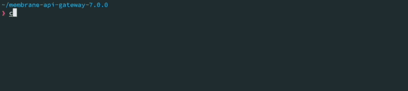
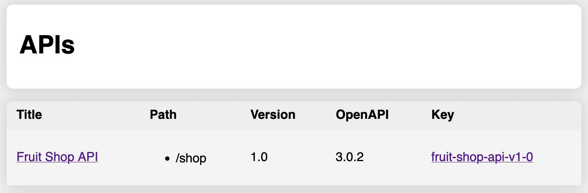
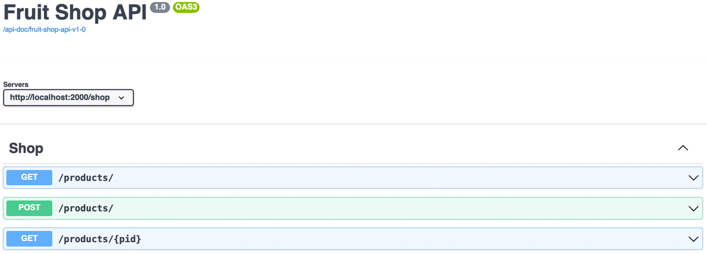
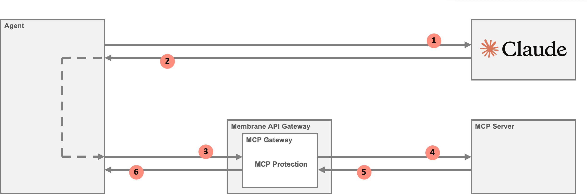
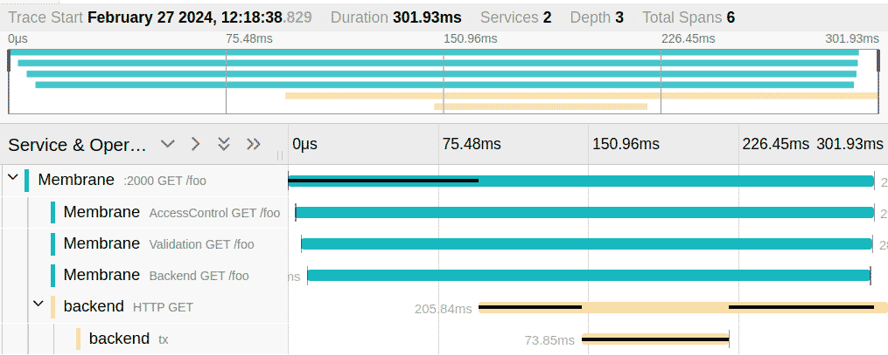
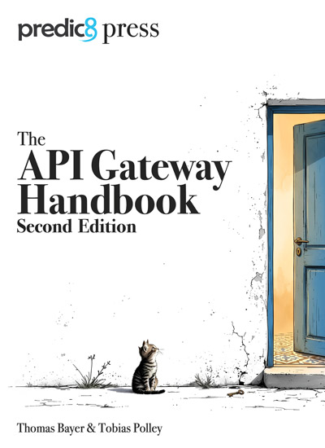

# Membrane API Gateway

**For REST, OpenAPI, and GraphQL with first-class Legacy Support for XML, SOAP, and WSDL**

[](https://github.com/membrane/api-gateway/releases/latest)
[](https://github.com/membrane/api-gateway/actions)
[](https://hub.docker.com/r/predic8/membrane)
[](https://github.com/membrane/api-gateway/blob/master/distribution/router/LICENSE.txt)



Built on the **Java platform**, Membrane bridges legacy and modern APIs. It supports **XML-to-JSON transformation**, **WSDL-to-OpenAPI conversion**, **SOAP-to-REST integration**, and validation against **OpenAPI** and **WSDL**.

For modern APIs, Membrane supports technologies such as OAuth 2, JWT, and AI, along with a broad range of routing, transformation, and observability features. It is easy to set up and deploy, either as a container or as a Java application on a virtual machine.

## Try Membrane in 5 Minutes

### Start the API Gateway

Run Membrane as a container or as a [Java application](https://www.membrane-api.io/getting-started.html):

```bash
docker run --rm -it -p 2000:2000 predic8/membrane
```

Open these URLs in your browser to access sample APIs:

- http://localhost:2000 (Actual time)
- http://localhost:2000/api-docs (API deployed from OpenAPI)

Or call an API from the command line:

```bash
curl http://localhost:2000/shop/v2/products
```

### Proxy Your First API

Create a file `apis.yaml` with the following content:

```yaml
api:
  port: 2000
  target:
    url: https://apibin.io
```

Start Membrane with your configuration:

**Linux/macOS:**

```bash
docker run --rm -p 2000:2000 -v "$(pwd)/apis.yaml:/opt/membrane/conf/apis.yaml" predic8/membrane
```

**Windows PowerShell:**

```pwsh
docker run --rm -p 2000:2000 -v "${PWD}/apis.yaml:/opt/membrane/conf/apis.yaml" predic8/membrane
```

Requests to http://localhost:2000 are now forwarded to https://apibin.io.

### Make the Getting Started Tutorial

1. [Download](https://github.com/membrane/api-gateway/releases/latest) the Membrane distribution
2. Unzip
3. Open [tutorials/getting-started/10-First-API.yaml](distribution/tutorials/getting-started/10-First-API.yaml) in your text editor and follow the instructions.


# Why Membrane

From OpenAPI and OAuth to SOAP, XML, LLMs, and MCP, Membrane bridges modern APIs and enterprise integration.

## Native OpenAPI Support

Deploy APIs directly from [OpenAPI](https://www.membrane-api.io/openapi/configuration-and-validation) documents, [validate](distribution/examples/openapi/validation-simple) messages against them, and even generate OpenAPI specifications from legacy WSDL. In addition to OpenAPI 3.0, and 3.1, Membrane also supports **OpenAPI 3.2**.

## Legacy XML and Web Services Integration

`wsdl2openapi` transforms a Web Service's WSDL into an OpenAPI and uses the underlying XSD schema for the conversion between XML and JSON. Deploy a WSDL, and Membrane exposes the service as an API with an OpenAPI description.

XML and JSON are deeply integrated into Membrane. **XPath** and **JSONPath** expressions provide direct access to message data for routing, filtering, and transformation.

Templates and XSLT allow for flexible message transformation and SOAP-to-REST conversion.

## XML and Web Services Security

Secure legacy services with WSDL and XSD message validation, XML message protection, and XML signatures.

## OpenAPI, JSON Schema, XSD, and WSDL Validation

Validate messages against API and service specifications. Don't let invalid messages slip into your organization.

## Easy Configuration and Extensibility

Take a look at the samples below and the tutorials to see what just a few lines of configuration can do.

When you need more flexibility, extend Membrane with expressions and scripting using **JSONPath**, **XPath**, **Groovy**, or **SpEL**, or write your own plugin in **Java**. In most cases, custom Java code is not necessary.

## Speed & Footprint

Although Membrane is written in Java, it delivers high performance with a low memory footprint. HTTP streaming, Keep-Alive, and non-blocking processing enable efficient resource utilization and high throughput. The Membrane distribution is only about 55 MB, making it smaller than many other API gateways.

On a single server Membrane can process **39,000 requests per second**. However, raw throughput benchmarks often measure only simple proxying without message protection or transformation.

Membrane is implemented entirely in Java, from the HTTP engine to OpenAPI processing. This avoids the overhead of crossing between a native proxy core and a separate scripting runtime for plugins.

As a result, Membrane can maintain high performance even when multiple plugins for validation, security, and transformation are active. What matters is not performance in reduced benchmark setups, but performance under realistic gateway configurations.

# What Can You Do With Membrane?

* **Expose and protect APIs** for partners over the public Internet.
* **Secure APIs** with OAuth 2.0, JWT, API keys, TLS, and message validation.
* **Modernize legacy services** by integrating SOAP, XML, and WSDL with REST, JSON, and OpenAPI.
* **Transform messages** between JSON, XML, SOAP, HTTP headers, query parameters, and other formats.
* **Route and control traffic** with flexible rules, rate limiting, load balancing, and conditional processing.
* Use Membrane as an **outgoing gateway** to control access to partner and public APIs.
* **Observe API traffic** with logging, metrics, Prometheus, and OpenTelemetry tracing.
* Use Membrane as an **AI Gateway** for LLM providers and MCP servers.
* Replace maintenance-intensive **Backend for Frontend (BFF)** services with declarative gateway configuration where appropriate.
* **Embed Membrane** into your own Java applications and products.
* Deploy Membrane in **containers, virtual machines, private clouds, or public clouds**.


# Membrane Features with Exsamples 

For a quick overview of what you can do with Membrane, the sections below provide a selection of short examples and configuration snippets.

1. [OpenAPI Deployment, Message Validation and Swagger UI](#1-openapi-deployment-message-validation-and-swagger-ui)
2. [Legacy Web Services with SOAP and WSDL](#2-legacy-web-services-with-soap-and-wsdl)
   - [API Configuration from WSDL](#api-configuration-from-wsdl)
   - [Message Validation against WSDL and XSD](#message-validation-against-wsdl-and-xsd)
3. [AI and LLM Gateway](#3-ai-and-llm-gateway)
   - [MCP Protection](#mcp-protection)
   - [LLM Gateway](#llm-gateway)
4. [Routing](#4-routing)
5. [Message Transformation](#5-message-transformation)
   - [Templates](#templates)
6. [Scripting](#6-scripting)
   - [Conditional Processing With the ´if´-Statement](#conditional-processing-with-the-if-statement)
7. [Security](#7-security)
   - [API Keys](#api-keys)
   - [JSON Web Tokens](#json-web-tokens)
   - [OAuth2](#oauth2)
   - [SSL/TLS](#ssltls)
   - [XML, JSON, JSON-RPC and GraphQL Protection](#xml-json-json-rpc-and-graphql-protection)
8. [Traffic Control](#8-traffic-control)
   - [Rate Limiting](#rate-limiting)
   - [Load Balancing](#load-balancing)
9. [Operation](#9-operation)
   - [Monitoring with Prometheus and Grafana](#monitoring-with-prometheus-and-grafana)
   - [OpenTelemetry Integration](#opentelemetry-integration)
10. [Community and Enterprise Support](#10-community-and-enterprise-support)
    - [Community Support](#community-support)
    - [Enterprise-Grade Support](#enterprise-grade-support)
    - [API Gateway eBook(Free Download)](#api-gateway-ebookfree-download)
    - [Participate in the API Tech Talk](#participate-in-the-api-tech-talk)

# 1. OpenAPI Deployment, Message Validation and Swagger UI

OpenAPI is a native feature in Membrane. The gateway supports OpenAPI 3.0, 3.1, and 3.2, including the QUERY HTTP method.

Membrane can deploy an API directly from an OpenAPI description. It uses the defined paths, schemas, operations, and backend URLs to configure routing and, optionally, validate incoming requests and outgoing responses.

```yaml
api:
  port: 2000
  openapi:
    - location: openapi/fruitshop-v2-2-0.oas.yml
      validateRequests: true
```

Membrane lets you explore APIs deployed from OpenAPI APIs in a single overview page.



For documentation and testing the gateway hosts also a Swagger UI for the deployed APIs.



See: [OpenAPI tutorial](distribution/tutorials/openapi/)

# 2. Legacy Web Services with SOAP and WSDL

Integrate and modernize legacy SOAP web services.

## API Configuration from WSDL

Membrane can create a SOAP proxy directly from a WSDL:

```yaml
soapProxy:
  port: 2000
  wsdl: https://www.predic8.de/city-service?wsdl
```

After startup, Membrane exposes:

- A SOAP endpoint at http://localhost:2000/city-service
- A rewritten WSDL at http://localhost:2000/city-service?wsdl

## Message Validation against WSDL and XSD

The `validator` checks SOAP messages against a WSDL document including referenced XSD schemas.

```yaml
soapProxy:
  port: 2000
  wsdl: https://www.predic8.de/city-service?wsdl
  flow:
    # Validates SOAP messages against the WSDL and XSDs
    - validator: {}
```

# 3. AI and LLM Gateway

Membrane can act as a gateway for **Large Language Models (LLMs)** and **Model Context Protocol (MCP)** servers, providing centralized access control, usage policies, and API key management.

## MCP Protection

The `mcpProtection`plugin sits in front of an MCP server and controls which tools clients can discover and call.



```yaml
api:
  port: 2000
  flow:
    - mcpProtection:
        tools:
          - allow: getCustomers
          - allow: getOrders
          - deny: '.*'
  target:
    url: http://my-mcp-server
```

See the [MCP protection tutorial](distribution/tutorials/mcp/20-MCP-Protection.yaml).

## LLM Gateway

The `llmGateway` plugin routes requests to LLM providers such as **Anthropic Claude**, **OpenAI**, and **Google Gemini**. It can centralize provider API keys and enforce policies for token usage and allowed models.

```yaml
api:
  port: 2000
  flow:
    - llmGateway:
        claude: {}
        apiKey: <<Replace with your API_KEY>>
        policies:
          maxOutputTokens: 100000
          models:
            - claude-opus-4-8
            - claude-sonnet-5
        simpleStore:
          users:
            - name: alice
              apiKey: abc123
              tokens: 2000000
            - name: bob
              apiKey: qwertz
              tokens: 10000000
          limitResetPeriod: 86400
  target:
    url: https://api.anthropic.com
```

Instead of handing the API key to every developer, keep it in the gateway and issue per-user keys. Membrane authenticates the user, enforces a per-user token budget, restricts the allowed models, and forwards the request using the shared provider key.

See: [LLM key sharing tutorial](distribution/tutorials/llm-gateway/claude/20-Sharing-API-Keys.yaml).

# 4. Routing

Membrane provides flexible routing based on HTTP properties and custom expressions.

```yaml
# Only GET to /products on port 2000
api:
  port: 2000
  method: GET
  path: /products
  flow:
    - response:
        - static:
            src: Oui!
    - return:
        status: 200
```

There are many routing options:

| Option   | Description                                                               |
|----------|---------------------------------------------------------------------------|
| `port`   | Listening port                                                            |
| `method` | HTTP method, e.g. `GET`, `POST`, `QUERY`                                  |
| `path`   | Request path                                                              |
| `host`   | Hostname, e.g. `api.predic8.de`                                           |
| `test` | Custom expression, e.g. `header['content-type'].startsWith('text/plain')` |

See the [API reference documentation](https://www.membrane-api.io/docs/current/api.html).

# 5. Message Transformation

## Templates

Templates can transform request and response bodies using data from the current message or the environment.

```yaml
api:
  port: 2000
  flow:
    - request:
        - template:
            contentType: application/json
            src: |
              {
                "destination": ${json.city}
              }
    - return:
        status: 200
```

For example, this JSON:

```json
{"city": "Berlin"}
```

is transformed into:

```json
{"destionation": "Berlin"}
```

Templates can access message data using **JSONPath**, **XPath**, and **Groovy**.


# 6. Scripting

Scripts can inspect and modify requests, responses, and extend gateway behavior. This makes it possible to implement custom API logic for use cases such as:

- **Routing:** Load balance requests across multiple backends
- **Error Handling:** Create custom error responses
- **Orchestration:** Chain multiple APIs together to form a complex workflow
- **Creating Responses:** Tailor responses dynamically based on client requests or internal logic.
- **Mocking APIs:** Simulate API behavior during testing or development phases.
- **Debugging and Tracing:** Inspect incoming requests during development.


```yaml
api:
  port: 2000
  flow:
    - groovy:
        src: |
          println "I'm executed in the ${flow} flow"
          println "HTTP Headers:\n${header}"
  target:
    url: https://api.predic8.de
```

You can write scripts in **Groovy** and **JavaScript**.

## Conditional Processing With the ´if´-Statement

A Membrane flow does not have to follow a fixed sequence. The `if` and `choose` plugins let you execute parts of a flow only when specific conditions are met. A common use case is error handling.

```yaml
api:
  port: 2000
  flow:
    - response:
        - if:
            test: statusCode >= 500
            flow:
              - static:
                  src: Failure!
  target:
    url: https://httpbin.org/status/500
```

# 7. Security

Membrane provides security features for protecting APIs, services, and backend systems.

## API Keys

Incoming requests can be authenticated by validating an API key against keys stored in a file or database.

```yaml
global:
  - apiKey:
      stores:
        - simple:
            - secret:
                value: aed8bcc4-7c83-44d5-8789-21e4024ac873
            - secret:
                value: 08f121fa-3cda-49c6-90db-1f189ff80756
      extractors:
        - header: X-Api-Key
```

Membrane also supports:

- Defining permissions as **scopes** in **OpenAPI** and enforcing them with API keys.
- Extracting API keys from headers, query parameters, or custom locations using expressions.
- Role-based access control (RBAC) with fine-grained permissions.

See the [API Key Tutorials](./distribution/tutorials/api-key)

## JSON Web Tokens

The API below only allows requests that present a valid JSON Web Token issued by Microsoft Azure Entra ID.

```yaml
api:
  port: 2000
  flow:
    - jwtAuth:
        expectedAud: api://2axxxx16-xxxx-xxxx-xxxx-faxxxxxxxxf0
        jwks:
          jwksUris: https://login.microsoftonline.com/common/discovery/keys
  target:
    url: https://your-backend
```

## OAuth2

### Secure APIs with OAuth2

Use OAuth2/OpenID to secure endpoints against Google, Azure Entra ID, GitHub, Keycloak or Membrane Authentication Servers.

```yaml
api:
  port: 2000
  flow:
    - oauth2Resource2:
        membrane:
          src: http://localhost:8000
          clientId: abc
          clientSecret: def
          scope: openid profile
          claims: username
          claimsIdt: sub
    - request:
        # Forward the authenticated user’s email to the backend in an HTTP header.
        - setHeader:
            name: X-EMAIL
            value: ${property['membrane.oauth2'].userinfo['email']}
  target:
    url: http://backend
```

Try the [OAuth tutorial](distribution/tutorials/oauth)

## Membrane as Authorization Server

The following example shows a minimal configuration for running Membrane as an OAuth 2.0 authorization server.

```yaml
api:
  port: 8000
  flow:
    - oauth2authserver:
        issuer: http://localhost:8000
        location: logindialog
        consentFile: consentFile.json
        staticUserDataProvider:
          users:
            - username: john
              password: secret
              email: john@predic8.de
        staticClientList:
          clients:
            - clientId: abc
              clientSecret: def
              callbackUrl: http://localhost:2000/oauth2callback
        bearerToken: {}
        claims:
          value: aud email iss sub username
          scopes:
            - id: username
              claims: username
            - id: profile
              claims: username email
```

User accounts can be stored in a file, in an LDAP server or backed by a database.

## SSL/TLS

This example enables TLS for connections from clients to the API Gateway:

```yaml
api:
  port: 443
  ssl:
    keystore:
      location: keystore.p12
      password: changeit
    truststore:
      location: keystore.p12
      password: changeit
  target:
    url: http://backend
```

Membrane supports advanced TLS scenarios, including:

- TLS termination at the API Gateway with optional TLS forwarding to the backend.
- SNI-based routing.
- Routing TLS connections without decrypting them.


See the [TLS/SSL tutorial](/distribution/tutorials/ssl-tls)

## XML, JSON, JSON-RPC and GraphQL Protection

Membrane protects APIs from risks associated with XML, JSON, JSON-RPC and GraphQL payloads.

```yaml
api:
  port: 2000
  flow:
    - xmlProtection:
        maxAttributeCount: 3
        maxElementNameLength: 100
        removeDTD: true
    - return:
        status: 200
```  

See the [XML protection](https://www.membrane-api.io/docs/current/xmlProtection.html), [JSON protection ](https://www.membrane-api.io/docs/current/jsonProtection.html), [JSON-RPC protection](https://www.membrane-api.io/docs/current/jsonRPCProtection.html), and [GraphQl protection ](https://www.membrane-api.io/docs/current/graphQLProtection.html) references.

# 8. Traffic Control

## Rate Limiting

Limit the number of incoming requests within a defined time period:

```yaml
global:
  - rateLimiter:
      requestLimit: 1000
      requestLimitDuration: PT1H
```

## Load Balancing

Distribute the workload across multiple API backend nodes. 

```yaml
api:
  port: 8080
  flow:
    - balancer:
        clusters:
          - name: Default
            nodes:
              - host: my.backend-1
                port: 4000
              - host: my.backend-2
                port: 4000
              - host: my.backend-3
                port: 4000
```

See the [API loadbalancing examples](distribution/examples/loadbalancing)

# 9. Operation

## Monitoring with Prometheus and Grafana

Expose Membrane metrics for Prometheus:

```yaml
api:
  port: 2000
  path:
    uri: /metrics
  flow:
    - prometheus: {}
```

The collected metrics can be visualized in a Grafana dashboard:


## OpenTelemetry Integration
Membrane supports integration with **OpenTelemetry**. This enables detailed tracing of requests across Membrane and backend services.

  

For working examples of Prometheus, Grafana and OpenTelemetry  see the [operation tutorial](./distribution/tutorials/operation).

# Community and Enterprise Support

## Community Support

To get support from our community, post your questions to our [discussions](https://github.com/membrane/api-gateway/discussions) page @GitHub.

If you find a bug, report it using [GitHub Issues](https://github.com/membrane/api-gateway/issues). Please provide a minimal example that reproduces the issue and the version of Membrane you are using.

## Enterprise-Grade Support

See [commercial support options and pricing](https://www.membrane-api.io/api-gateway-pricing.html).


## API Gateway eBook(Free Download)

Learn how API Gateways work through practical scenarios and real-world examples.



[Download](https://www.membrane-api.io/ebook/API-Gateway-Handbook-v2.0.0.pdf) instantly. **No registration** required.

## Participate in the API Tech Talk

Meet other Membrane users **online** to discuss API gateway operation and architecture. Membrane developers answer questions and welcome your feedback and feature requests.

### Upcoming Topics

- **September 30, 2026** Legacy Integration with XML, SOAP, and WSDL
- **October 28, 2026** Authentication with JSON Web Tokens (JWT)
- **November 25, 2026** MCP and AI Tool Integration
- **December 30, 2026** Message Transformation

[Learn more](https://www.membrane-api.io/user-meeting/)

