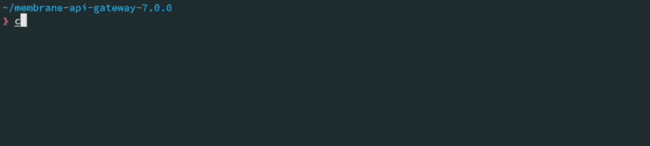
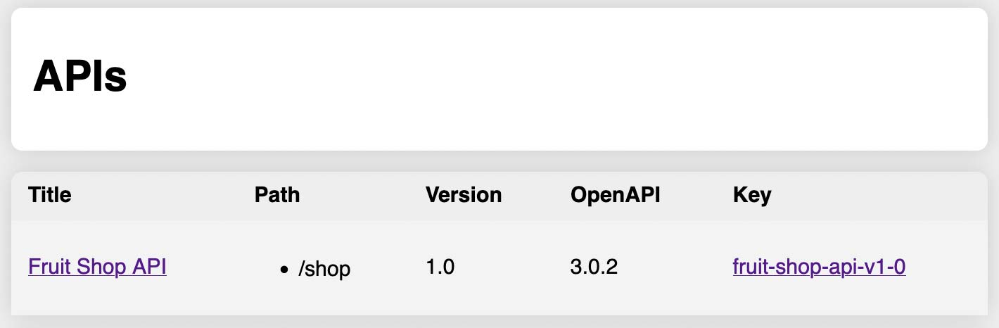
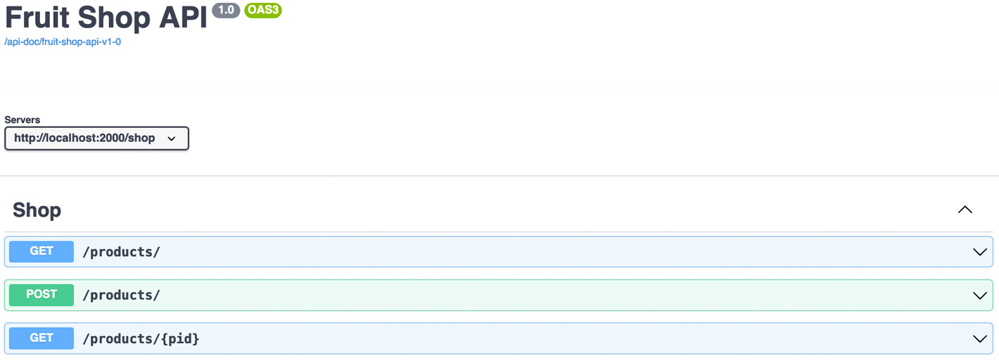
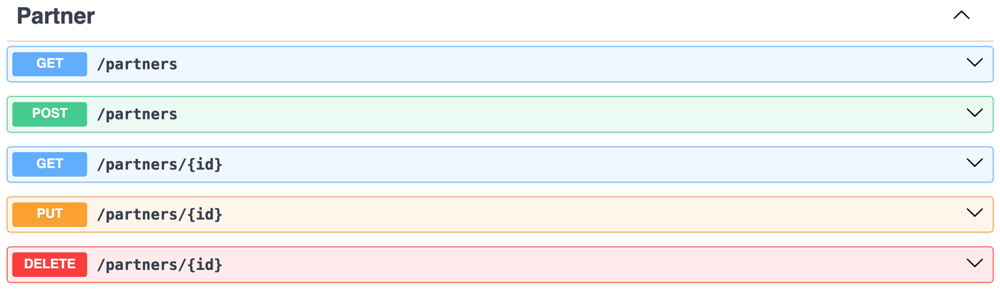
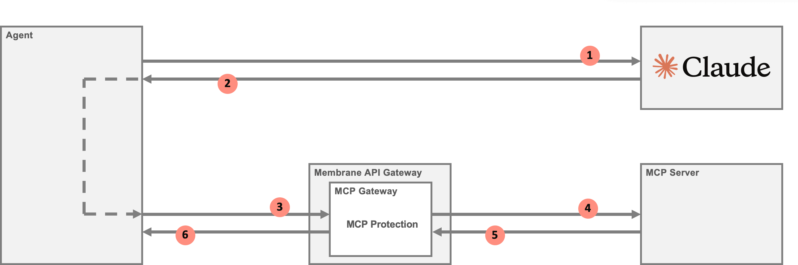
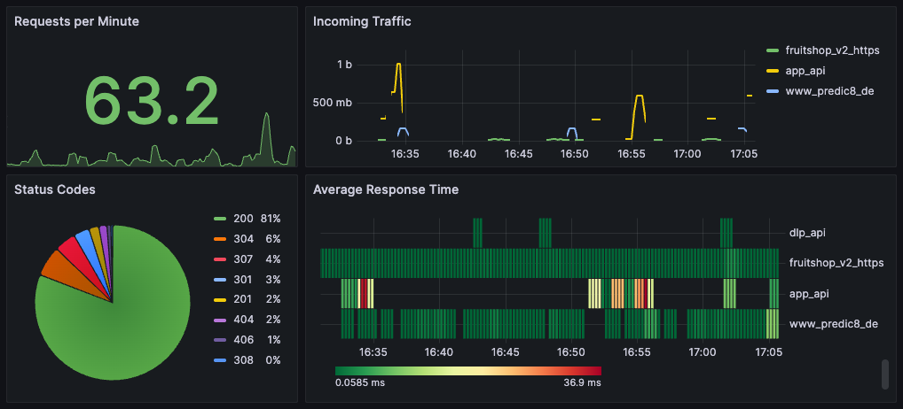
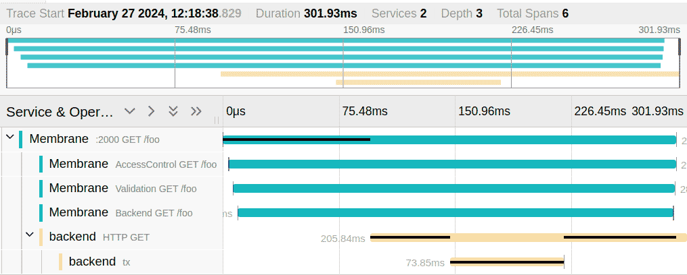
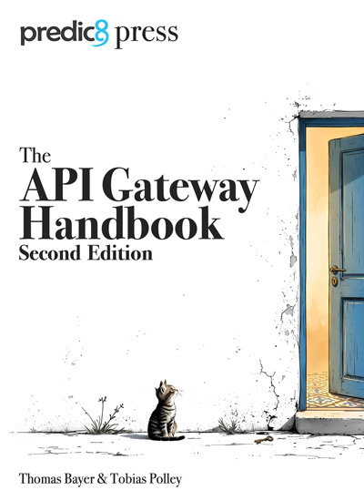

# Membrane API Gateway

**Open-source API gateway that speaks both REST and SOAP.**

[](https://github.com/membrane/api-gateway/releases/latest)
[](https://hub.docker.com/r/predic8/membrane)
[](https://github.com/membrane/api-gateway/blob/master/distribution/router/LICENSE.txt)



Deploy APIs directly from [OpenAPI](#1-openapi-deployment-validation-and-swagger-ui), secure them with [OAuth2](#oauth2) and [JWT](#json-web-tokens), or turn legacy [SOAP web services into JSON APIs](#wsdl-to-openapi-conversion), all with a few lines of YAML. [Lightweight](#high-throughput-small-footprint) and easy to run as a single **container** or **Java** application. No database required.

## Start Membrane

```bash
docker run --rm -it -p 2000:2000 predic8/membrane
```

Explore the sample APIs in your browser:

- http://localhost:2000 (Current time)
- http://localhost:2000/api-docs (API deployed from OpenAPI)
- http://localhost:2000/shop/v2/products

Prefer Java instead of Docker? Follow the [Java quickstart](https://www.membrane-api.io/getting-started.html).

### Proxy Your First API

Create an `apis.yaml` file containing the following configuration:

```yaml
api:
  port: 2000
  target:
    url: https://apibin.io
```

Run a container with the `apis.yaml` file mounted:

**Linux/macOS:**

```bash
docker run --rm -p 2000:2000 -v "$(pwd)/apis.yaml:/opt/membrane/conf/apis.yaml" predic8/membrane
```

**Windows PowerShell:**

```pwsh
docker run --rm -p 2000:2000 -v "${PWD}/apis.yaml:/opt/membrane/conf/apis.yaml" predic8/membrane
```

Requests to http://localhost:2000 are now forwarded to https://apibin.io.

### Follow the Tutorials

1. [Download](https://github.com/membrane/api-gateway/releases/latest) and unzip the Membrane distribution
2. Open [tutorials/getting-started/10-First-API.yaml](distribution/tutorials/getting-started/10-First-API.yaml) in a text editor and work through the steps.
3. Continue with the other [tutorials](distribution/tutorials/README.md) on OpenAPI, security, SOAP, AI, and more.

# Why Membrane

## Native OpenAPI Support

Deploy APIs from [OpenAPI](https://www.membrane-api.io/openapi/configuration-and-validation) descriptions and use [OpenAPI for messge validation](distribution/examples/openapi/validation-simple). Membrane supports OpenAPI 3.0, 3.1, and **3.2**.

## Legacy XML and Web Services Integration

Expose existing [SOAP web services as JSON APIs](#manual-soap-to-rest-conversion) without changing the backend. Membrane’s [wsdl2openapi](#wsdl-to-openapi-conversion) generates OpenAPI descriptions from WSDL and uses it to convert between JSON and XML.

Use **XPath** and **JSONPath** to access message data for [routing](#4-routing), filtering, and transformation. Templates and XSLT handle custom formats and more complex conversions.

Apply the same routing, [transformation](#5-message-transformation), and orchestration capabilities to legacy SOAP services and modern JSON APIs.

## Protect APIs and Legacy Services

Validate messages against **OpenAPI**, **JSON Schema**, **XSD**, and **WSDL** to reject invalid requests before they reach your backend. Apply XML, JSON, and GraphQL protection to guard against malicious payloads.

Secure APIs with **API keys**, **OAuth2**, and **JWT**, and protect SOAP services with **WS-Security**, including **XML signatures and encryption**.

## API Orchestration

[Combine calls](#6-orchestration-and-call-outs) to multiple APIs in a single flow. Process collections with loops and control execution with conditions.

## Simple Configuration, Flexible Extensions

Configure routing, security, and transformations with a few lines of YAML. Explore the examples below and the [tutorials](https://www.membrane-api.io/api-gateway-tutorial.html) to [get started](https://www.membrane-api.io/getting-started.html).

For custom logic, use [Groovy scripts](#7-scripting) or expressions with **SpEL**, **JSONPath**, and **XPath**. When you need deeper integration, write your own Java plugin. No need to learn Lua.

## High Throughput, Small Footprint

Membrane stays fast with security and validation enabled. In benchmarks on a 16-vCPU Azure VM, it achieved:

| Configuration                             | Requests/sec |
|-------------------------------------------|-------------:|
| Plain proxying                            |  **128,723** |
| Basic Auth + rate limiting + TLS          |  **109,542** |
| OpenAPI validation of every request       |   **89,197** |

Membrane’s HTTP engine was built specifically for API gateway workloads. Its Java plugins run in the same process, keeping overhead low. This integrated design gives Membrane an architectural advantage over gateways built on general-purpose HTTP servers and helps it deliver outstanding performance.

The distribution is approximately 55 MB, runs as a container or Java application, and requires no database.

See the [benchmark setup and results](https://www.membrane-api.io/api-gateway-performance.html), or [run the tests yourself](distribution/performance-test/README.md).

# What Can You Do With Membrane?

* **Expose and protect APIs** for partners over the public Internet.
* [Secure APIs](#8-security) with [OAuth 2](#oauth2), [JWT](#json-web-tokens), [API keys](#api-keys), TLS, and message validation.
* [Modernize legacy services](#legacy-xml-and-web-services-integration) by integrating SOAP, XML, and WSDL with REST, JSON, and OpenAPI.
* [Transform messages](#5-message-transformation) between JSON, XML, SOAP, HTTP headers, query parameters, and other formats.
* [Route](#4-routing) and [control traffic](#9-traffic-control) with flexible rules, rate limiting, load balancing, and conditional processing.
* Use Membrane as an **outgoing gateway** to control access to partner and public APIs.
* **Observe API traffic** with logging, metrics, [Prometheus, Grafana](#monitoring-with-prometheus-and-grafana) and [OpenTelemetry](#opentelemetry-integration) tracing.
* Use Membrane as an [AI Gateway](#3-ai-and-llm-gateway) for LLM providers and MCP servers.
* Replace maintenance-intensive **Backend for Frontend (BFF)** services with declarative gateway configuration where appropriate.
* **Embed Membrane** into your own Java applications and products.
* Deploy Membrane in **containers**, **virtual machines**, **private clouds**, or **public clouds**.


# Membrane Features with Examples 

For a quick overview of what you can do with Membrane, the sections below provide a selection of short examples and configuration snippets.

1. [OpenAPI Deployment, Validation and Swagger UI](#1-openapi-deployment-validation-and-swagger-ui)
2. [Legacy Web Services with SOAP and WSDL](#2-legacy-web-services-with-soap-and-wsdl)
   - [WSDL to OpenAPI Conversion](#wsdl-to-openapi-conversion)
   - [API Configuration from WSDL](#api-configuration-from-wsdl)
   - [Message Validation against WSDL and XSD](#message-validation-against-wsdl-and-xsd)
   - [Web Services Security (WSS)](#web-services-security-wss)
3. [AI and LLM Gateway](#3-ai-and-llm-gateway)
   - [MCP Protection](#mcp-protection)
   - [LLM Gateway](#llm-gateway)
4. [Routing](#4-routing)
5. [Message Transformation](#5-message-transformation)
   - [POST to GET with Query Parameters](#post-to-get-with-query-parameters)
   - [Templates](#templates)
6. [Orchestration and Call Outs](#6-orchestration-and-call-outs)
7. [Scripting](#7-scripting)
   - [Conditional Processing With the 'if'-Statement](#conditional-processing-with-the-if-statement)
8. [Security](#8-security)
   - [API Keys](#api-keys)
   - [JSON Web Tokens](#json-web-tokens)
   - [OAuth2](#oauth2)
   - [SSL/TLS](#ssltls)
   - [XML, JSON, JSON-RPC and GraphQL Protection](#xml-json-json-rpc-and-graphql-protection)
9. [Traffic Control](#9-traffic-control)
   - [Rate Limiting](#rate-limiting)
   - [Load Balancing](#load-balancing)
10. [Operation](#10-operation)
   - [Monitoring with Prometheus and Grafana](#monitoring-with-prometheus-and-grafana)
   - [OpenTelemetry Integration](#opentelemetry-integration)

# 1. OpenAPI Deployment, Validation and Swagger UI

OpenAPI is a native feature in Membrane. The gateway supports OpenAPI 3.0, 3.1, and 3.2, including the QUERY HTTP method.

Membrane can deploy an API directly from an OpenAPI description. It uses the defined paths, schemas, operations, and backend URLs to configure routing and, optionally, validate incoming requests and outgoing responses.

```yaml
api:
  port: 2000
  openapi:
    - location: openapi/fruitshop-v2-2-0.oas.yml
      validateRequests: true
```

Membrane lets you explore APIs deployed from OpenAPI in a single overview page.



For documentation and testing, the gateway also hosts a Swagger UI for the deployed APIs.



See: [OpenAPI tutorial](distribution/tutorials/openapi/)

# 2. Legacy Web Services with SOAP and WSDL

Integrate and modernize legacy SOAP web services.

## WSDL to OpenAPI Conversion

Membrane can expose a SOAP web service described by WSDL as a REST API with an OpenAPI specification.

This configuration:

```yaml
api:
  port: 2000
  flow:
    - wsdl2openapi:
        wsdl: mocks/partner.wsdl
        operations:
          getPartners:
            method: GET
            path: /partners
            tag: Partner
          getPartner:
            method: GET
            path: /partners/{id}
            tag: Partner
          createPartner:
            method: POST
            path: /partners
            tag: Partner
          updatePartner:
            method: PUT
            path: /partners/{id}
            tag: Partner
          deletePartner:
            method: DELETE
            path: /partners/{id}
            tag: Partner
  target:
    url: http://localhost:3000/partner-service
```

turns this [WSDL](distribution/tutorials/wsdl-to-openapi/mocks/partner.wsdl) into an OpenAPI specification including JSON schemas derived from the WSDL's XSD schemas:



After deploying this configuration, clients can send JSON requests to the REST API. Membrane transforms them into SOAP requests for the backend Web Service and converts the XML responses back to JSON.

The conversion uses the XML Schema definitions from the WSDL to map data precisely between JSON and XML.

## Manual SOAP to REST Conversion

The easiest way to expose a SOAP Web Service as a REST API is to use the `wsdl2openapi` plugin described above.

For more control over the conversion, you can define the REST API manually and map individual REST endpoints to SOAP operations.

The following configuration accepts a request such as `GET /cities/Nairobi`, creates a SOAP request for the backend service, and transforms the SOAP response into JSON:

```yaml
api:
  port: 2000
  method: GET
  path:
    uri: /cities/{city}
  flow:
    - request:
        - soapBody:
            src: |
              <getCity xmlns="https://predic8.de/cities">
                  <name>${pathParam.city}</name>
              </getCity>
        - setHeader:
            name: SOAPAction
            value: https://predic8.de/cities/get
    - response:
        - template:
            contentType: application/json
            src: |
              {
                "country": ${xpath('//country')},
                "population": ${xpath('//population')}
              }
  target:
    # Change method to POST
    method: POST
    url: https://www.predic8.de/city-service
```

**Note:** Membrane automatically escapes expression values such as ${xpath(...)} for the specified content type.

See the [SOAP to REST tutorial](distribution/tutorials/soap-rest-converter) for more details.


## API Configuration from WSDL

Membrane can create a SOAP proxy directly from a WSDL:

```yaml
soapProxy:
  port: 2000
  wsdl: https://www.predic8.de/city-service?wsdl
```

After startup, Membrane exposes:

- A SOAP endpoint at http://localhost:2000/city-service
- A rewritten WSDL at http://localhost:2000/city-service?wsdl

## Message Validation against WSDL and XSD

The `validator` checks SOAP messages against a WSDL document including referenced XSD schemas.

```yaml
soapProxy:
  port: 2000
  wsdl: https://www.predic8.de/city-service?wsdl
  flow:
    # Validates SOAP messages against the WSDL and XSDs
    - validator: {}
```

## Web Services Security (WSS)

Legacy SOAP services protected with **Web Services Security (WS-Security)** may require credentials and an XML Signature.

```yaml
api:
  port: 2000
  flow:
     - wsSecurity:
         secure:
           - usernameToken:
               username: alice
               password: secret
           - signature:
               references:
                 - by: BODY
                 - by: USERNAME_TOKEN
  target:
    url: http://localhost:2001
```

Membrane can create and validate **WS-Security UsernameTokens** and XML Signatures.


# 3. AI and LLM Gateway

Membrane can act as a gateway for **Large Language Models (LLMs)** and **Model Context Protocol (MCP)** servers, providing centralized access control, usage policies, and API key management.

## MCP Protection

The `mcpProtection` plugin sits in front of an MCP server and controls which tools clients can discover and call.



```yaml
api:
  port: 2000
  flow:
    - mcpProtection:
        tools:
          - allow: getCustomers
          - allow: getOrders
          - deny: '.*'
  target:
    url: http://my-mcp-server
```

See the [MCP protection tutorial](distribution/tutorials/mcp/20-MCP-Protection.yaml).

## LLM Gateway

The `llmGateway` plugin routes requests to LLM providers such as **Anthropic Claude**, **OpenAI**, and **Google Gemini**. It can centralize provider API keys and enforce policies for token usage and allowed models.

```yaml
api:
  port: 2000
  flow:
    - llmGateway:
        claude: {}
        apiKey: <<Replace with your API_KEY>>
        policies:
          maxOutputTokens: 100000
          models:
            - claude-opus-5-5
            - claude-sonnet-5
        simpleStore:
          users:
            - name: alice
              apiKey: abc123
              tokens: 2000000
            - name: bob
              apiKey: qwertz
              tokens: 10000000
          limitResetPeriod: 86400
  target:
    url: https://api.anthropic.com
```

Instead of handing the API key to every developer, keep it in the gateway and issue per-user keys. Membrane authenticates the user, enforces a per-user token budget, restricts the allowed models, and forwards the request using the shared provider key.

See: [LLM key sharing tutorial](distribution/tutorials/llm-gateway/claude/20-Sharing-API-Keys.yaml).

# 4. Routing

Membrane provides flexible routing based on HTTP properties and custom expressions.

```yaml
# Only GET to /products on port 2000
api:
  port: 2000
  method: GET
  path: /products
  flow:
    - response:
        - static:
            src: Oui!
    - return:
        status: 200
```

There are many routing options:

| Option   | Description                                                               |
|----------|---------------------------------------------------------------------------|
| `port`   | Listening port                                                            |
| `method` | HTTP method, e.g. `GET`, `POST`, `QUERY`                                  |
| `path`   | Request path                                                              |
| `host`   | Hostname, e.g. `api.predic8.de`                                           |
| `test` | Custom expression, e.g. `header['content-type'].startsWith('text/plain')` |

See the [API reference documentation](https://www.membrane-api.io/docs/current/api.html).

# 5. Message Transformation

## POST to GET with Query Parameters

Transform a POST request such as:

```
POST /products
Content-Type: application/json

{"limit": 100, "sort": "name"}
```

into a GET request like `GET /products?limit=100&sort=name` using a URI template with **JSONPath** expressions:

```yaml
api:
  port: 2000
  target:
    method: GET
    url: https://api.predic8.de/shop/v2/products?sort=${$.sort}&limit=${$.limit}
    language: jsonpath
```

**Note:** Membrane automatically escapes expression values such as `${$.sort}` for the specified content type.

See the [tutorial](distribution/tutorials/transformation/20-GET-to-POST.yaml) to transform from **GET to POST**.

## Transformation between XML and JSON

Both converters use a heuristic mapping and do not require a JSON or XSD schema.

```yaml
flow:
  - xml2Json: {}
```

```yaml
flow:
  - json2Xml:
      root: order
```

See [transformation tutorials](distribution/tutorials/transformation) for other ways to transform between XML and JSON.

## Templates

Templates can transform request and response bodies using data from the current message or the environment.

Membrane uses a **Groovy-based template** engine with dynamic constructs such as **loops** and **conditionals**. Its syntax is similar to template engines commonly used in web applications.

The example creates a JSON document containing the names and values of the request's HTTP headers.

```yaml
- template:
    contentType: application/json
    pretty: true
    src: |
      {
        <% header.eachWithIndex { e, i -> %>
          <% if (i > 0) { %>,<% } %>
          <%= e.key %>: <%= e.value %>
        <% } %>
      }
```

Templates can access message data using **JSONPath**, **XPath**, and **Groovy**.

# 6. Orchestration and Call Outs

Membrane can orchestrate calls to external APIs and process collections with **loops** and **conditional** flows.

The example iterates over a list of fruits and sends a POST request for each item:

```yaml
api:
  port: 2000
  flow:
    - for:
        # Loops over a list of objects [{ "name": "Mango", "price": 1.23 }, ..]
        in: $.fruits
        language: jsonpath
        flow:
          - setBody:
              # Serialize the current item to a JSON string
              value: ${toJSON(it)}
          # callout to an external API
          - call:
              method: POST
              url: https://api.predic8.de/shop/v2/products
          - log:
              message: "Created product: ${it['name']}"
    - return:
        status: 200
```

See [orchestration tutorials](distribution/tutorials/orchestration)


# 7. Scripting

Scripts can inspect and modify requests, responses, and extend gateway behavior. This makes it possible to implement custom API logic for use cases such as:

- **Routing:** Load balance requests across multiple backends
- **Error Handling:** Create custom error responses
- **Orchestration:** Chain multiple APIs together to form a complex workflow
- **Creating Responses:** Tailor responses dynamically based on client requests or internal logic.
- **Mocking APIs:** Simulate API behavior during testing or development phases.
- **Debugging and Tracing:** Inspect incoming requests during development.


```yaml
api:
  port: 2000
  flow:
    - groovy:
        src: |
          println "I'm executed in the ${flow} flow"
          println "HTTP Headers:\n${header}"
  target:
    url: https://api.predic8.de
```

You can write scripts in **Groovy** and **JavaScript**.

## Conditional Processing With the `if`-Statement

A Membrane flow does not have to follow a fixed sequence. The `if` and `choose` plugins let you execute parts of a flow only when specific conditions are met. A common use case is error handling.

```yaml
api:
  port: 2000
  flow:
    - response:
        - if:
            test: statusCode >= 500
            flow:
              - static:
                  src: Failure!
  target:
    url: https://httpbin.org/status/500
```

# 8. Security

Membrane provides security features for protecting APIs, services, and backend systems.

## API Keys

Incoming requests can be authenticated by validating an API key against keys stored in a file or database.

```yaml
global:
  - apiKey:
      stores:
        - simple:
            - secret:
                value: aed8bcc4-7c83-44d5-8789-21e4024ac873
            - secret:
                value: 08f121fa-3cda-49c6-90db-1f189ff80756
      extractors:
        - header: X-Api-Key
```

Membrane also supports:

- Defining permissions as **scopes** in **OpenAPI** and enforcing them with API keys.
- Extracting API keys from headers, query parameters, or custom locations using expressions.
- Role-based access control (RBAC) with fine-grained permissions.

See the [API Key Tutorials](./distribution/tutorials/api-keys)

## JSON Web Tokens

The API below only allows requests that present a valid JSON Web Token issued by Microsoft Azure Entra ID.

```yaml
api:
  port: 2000
  flow:
    - jwtAuth:
        expectedAud: api://2axxxx16-xxxx-xxxx-xxxx-faxxxxxxxxf0
        jwks:
          jwksUris: https://login.microsoftonline.com/common/discovery/keys
  target:
    url: https://your-backend
```

## OAuth2

### Secure APIs with OAuth2

Use OAuth2/OpenID to secure endpoints against Google, Azure Entra ID, GitHub, Keycloak or Membrane Authentication Servers.

```yaml
api:
  port: 2000
  flow:
    - oauth2Resource2:
        membrane:
          src: http://localhost:8000
          clientId: abc
          clientSecret: def
          scope: openid profile
          claims: username
          claimsIdt: sub
    - request:
        # Forward the authenticated user’s email to the backend in an HTTP header.
        - setHeader:
            name: X-EMAIL
            value: ${property['membrane.oauth2'].userinfo['email']}
  target:
    url: http://backend
```

Try the [OAuth tutorial](distribution/tutorials/oauth2)

## Membrane as Authorization Server

The following example shows a minimal configuration for running Membrane as an OAuth 2.0 authorization server.

```yaml
api:
  port: 8000
  flow:
    - oauth2authserver:
        issuer: http://localhost:8000
        location: logindialog
        consentFile: consentFile.json
        staticUserDataProvider:
          users:
            - username: john
              password: secret
              email: john@predic8.de
        staticClientList:
          clients:
            - clientId: abc
              clientSecret: def
              callbackUrl: http://localhost:2000/oauth2callback
        bearerToken: {}
        claims:
          value: aud email iss sub username
          scopes:
            - id: username
              claims: username
            - id: profile
              claims: username email
```

User accounts can be stored in a file, in an LDAP server or backed by a database.

## SSL/TLS

This example enables TLS for connections from clients to the API Gateway:

```yaml
api:
  port: 443
  ssl:
    keystore:
      location: keystore.p12
      password: changeit
    truststore:
      location: keystore.p12
      password: changeit
  target:
    url: http://backend
```

Membrane supports advanced TLS scenarios, including:

- TLS termination at the API Gateway with optional TLS forwarding to the backend.
- SNI-based routing.
- Routing TLS connections without decrypting them.


See the [TLS/SSL tutorial](distribution/tutorials/ssl-tls)

## XML, JSON, JSON-RPC and GraphQL Protection

Membrane protects APIs from risks associated with XML, JSON, JSON-RPC and GraphQL payloads.

```yaml
api:
  port: 2000
  flow:
    - xmlProtection:
        maxAttributeCount: 3
        maxElementNameLength: 100
        removeDTD: true
    - return:
        status: 200
```  

See the [XML protection](https://www.membrane-api.io/docs/current/xmlProtection.html), [JSON protection](https://www.membrane-api.io/docs/current/jsonProtection.html), [JSON-RPC protection](https://www.membrane-api.io/docs/current/jsonRPCProtection.html), and [GraphQL protection](https://www.membrane-api.io/docs/current/graphQLProtection.html) references.

# 9. Traffic Control

## Rate Limiting

Limit the number of incoming requests within a defined time period:

```yaml
global:
  - rateLimiter:
      requestLimit: 1000
      requestLimitDuration: PT1H
```

## Load Balancing

Distribute the workload across multiple API backend nodes. 

```yaml
api:
  port: 8080
  flow:
    - balancer:
        clusters:
          - name: Default
            nodes:
              - host: my.backend-1
                port: 4000
              - host: my.backend-2
                port: 4000
              - host: my.backend-3
                port: 4000
```

See the [API load balancing examples](distribution/examples/loadbalancing)

# 10. Operation

## Monitoring with Prometheus and Grafana

Expose Membrane metrics for Prometheus:

```yaml
api:
  port: 2000
  path:
    uri: /metrics
  flow:
    - prometheus: {}
```

The collected metrics can be visualized in a Grafana dashboard:



## OpenTelemetry Integration
Membrane supports integration with **OpenTelemetry**. This enables detailed tracing of requests across Membrane and backend services.

  

For working examples of Prometheus, Grafana and OpenTelemetry, see the [operation tutorial](./distribution/tutorials/operation).

# Community and Enterprise Support

## Community Support

To get support from our community, post your questions to our [discussions](https://github.com/membrane/api-gateway/discussions) page @GitHub.

If you find a bug, report it using [GitHub Issues](https://github.com/membrane/api-gateway/issues). Please provide a minimal example that reproduces the issue and the version of Membrane you are using.

## Enterprise-Grade Support

See [commercial support options and pricing](https://www.membrane-api.io/api-gateway-pricing.html).


## API Gateway eBook (Free Download)

Learn how API Gateways work through practical scenarios and real-world examples.



[Download](https://www.membrane-api.io/ebook/API-Gateway-Handbook-v2.0.0.pdf) instantly. **No registration** required.

## Participate in the API Tech Talk

Meet other Membrane users **online** to discuss API gateway operation and architecture. Membrane developers answer questions and welcome your feedback and feature requests.

### Upcoming Topics

- **September 30, 2026** Legacy Integration with XML, SOAP, and WSDL
- **October 28, 2026** Authentication with JSON Web Tokens (JWT)
- **November 25, 2026** MCP and AI Tool Integration
- **December 30, 2026** Message Transformation

[Learn more](https://www.membrane-api.io/user-meeting/)

