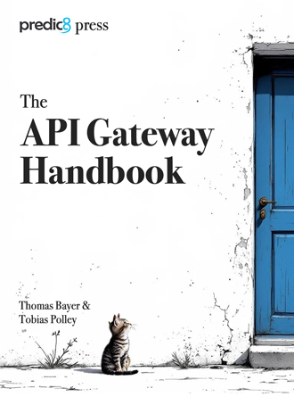

# API Gateway

[](https://github.com/membrane/service-proxy/releases/latest)
[](https://raw.githubusercontent.com/membrane/api-gateway/master/distribution/router/LICENSE.txt)

Lightweight **API Gateway** for **REST**, **GraphQL** and **legacy SOAP Web Services**, easily extended with powerful plugins and Java.

Solve even complex custom API requirements with simple configurations.

**Forwarding Requests from Port 2000 to a Backend:** 
```xml
<api port="2000">
  <target url="https://api.predic8.de"/>
</api>
```

**Deploy OpenAPI and enable Request Validation:** 
```xml
<api port="2000">
    <openapi location="fruitshop-api.yml" validateRequests="yes"/>
</api>
```

**Issue JSON Web Tokens for API Keys:**

Simple implementation of a token server. A request is authenticated by API key and a JWT for the user is created, signed and returned. By changing the template you can decide whats included in the JWT. 

```xml
<api port="2000">
   <apiKey required="true">
       <apiKeyFileStore location="keys.txt" />
   </apiKey>
   <request>
       <setProperty name="scopes" value="${scopes()}"/> 
       <template>
           {
              "sub": "user@example.com",
              "aud": "order",
              "scope": "${property.scopes}"   <!-- Scopes defined in keys.txt -->
           }
       </template>
       <jwtSign>
           <jwk location="jwk.json"/> <!-- Sign with RS256 -->
       </jwtSign>
   </request>
   <return /> <!-- return token-->
</api>
```

These are just a few examples; see the descriptions below for more.

## API Gateway eBook

Learn how API Gateways work with real-world examples and insights into Membrane.



[Download instantly](https://www.membrane-api.io/ebook/API-Gateway-Handbook-Pre-Release-2025-07-02.pdf) — **no registration** required.

## Features

### **OpenAPI**

- Deploy APIs from [OpenAPI specifications](https://www.membrane-api.io/openapi/configuration-and-validation).
- Validate requests and responses against [OpenAPI](distribution/examples/openapi/validation-simple) and **JSON Schema**.

### **API Security**
- [JSON Web Tokens](#json-web-tokens), [OAuth2](https://www.membrane-soa.org/service-proxy/oauth2-provider-client.html), [API Keys](#api-keys), [NTLM](distribution/examples/security/ntlm), and [Basic Authentication](https://www.membrane-soa.org/api-gateway-doc/current/configuration/reference/basicAuthentication.htm).
- Built-in [OAuth2 Authorization Server](https://www.membrane-soa.org/service-proxy-doc/4.8/security/oauth2/flows/code/index.html).
- [Rate limiting](#rate-limiting) and traffic control
- Protection for **GraphQL**, **JSON**, and **XML** APIs against malicious inputs.

### **Legacy Web Services**
- Seamless support for [SOAP message routing](#soap-web-services).
- Configure, validate, and rewrite WSDL-based services, including [message validation](#message-validation-against-wsdl-and-xsd).

### **Additional Features**
- **Admin Web Console** for monitoring and management.
- Advanced [load balancing](#load-balancing) to ensure high availability.
- Flexible [message transformation](#message-transformation) for seamless data processing.
- Embeddable reverse proxy HTTP framework to build custom API gateways.
- Traffic shadowing

### **Speed & Size**

- Streams HTTP traffic for low-latency, non-blocking processing.
- Reuses TCP connections via HTTP Keep-Alive to reduce request overhead.
- Lightweight distribution (~55MB) compared to other Java-based gateways.
- Low memory footprint, ideal for containers and cloud-native environments.
- Java-based, yet competitive with C/C++ gateways in performance.

# Content

1. [Getting Started](#Getting-Started)
   - [Java](#java)
   - [Docker](#docker)
2. [Basics](#Basics) Routing, rewriting
   - [API Definition and Configuration](#API-Definition-and-Configuration)
   - [Simple REST and HTTP Forwarding APIs](#simple-rest-and-http-forwarding-apis)
3. [OpenAPI Support](#openapi-support)
   - [Deploy APIs with OpenAPI](#deploy-apis-with-openapi)
4. [Routing](#routing)
    - [Short Circuit](#short-circuit)
    - [URL Rewriting](#url-rewriting)
5. [Scripting](#scripting)
    - With [Groovy](#groovy-scripts) and [Javascript](#javascript-scripts)
    - [Creating Responses with Groovy](#creating-responses-with-groovy)
6. [Message Transformation](#message-transformation)
    - [Manipulating](#manipulating-http-headers) and [removing](#removing-http-headers) HTTP Headers
    - [Create JSON from Query Parameters](#create-json-from-query-parameters)
    - [Transform JSON into TEXT, JSON or XML with Templates](#transform-json-into-text-json-or-xml-with-templates)
    - [Transform XML into Text or JSON](#transform-xml-into-text-or-json)
    - [Complex Transformations using Javascript or Groovy](#complex-transformations-using-javascript-or-groovy)
    - [Transformation with Computations](#transformation-with-computations)
    - [JSON and XML Beautifier](#json-and-xml-beautifier)
7. [Conditionals with if](#conditionals-with-if)
8. [Security](#security)
    - [API Keys](#api-keys) and [Basic Authentication](#basic-authentication)
    - [SSL/TLS](#ssltls)
    - [JSON Web Tokens](#json-web-tokens) JWT
    - [OAuth2](#oauth2)
      - [Secure APIs with OAuth2](#secure-apis-with-oauth2)
      - [Membrane as Authorization Server](#membrane-as-authorization-server)
    - [XML and JSON Protection](#xml-and-json-protection)
9. [Traffic Control](#Traffic-Control) Rate limiting, Load balancing
    - [Rate Limiting](#rate-limiting)
    - [Load Balancing](#load-balancing)
10. [Legacy Web Services](#soap-web-services) SOAP and WSDL
    - [API configuration from WSDL](#api-configuration-from-wsdl)
    - [Message Validation against WSDL and XSD](#message-validation-against-wsdl-and-xsd)
11. [Operation](#Operation)
   - [Logging](#log-http)
   - [Monitoring with Prometheus and Grafana](#monitoring-with-prometheus-and-grafana)
   - [OpenTelemetry](#opentelemetry-integration)

# Installation

You can run Membrane as Docker container, standalone Java application or install it on Linux as RPM.

## Java

1. **Download and extract**
  - [Download a release](https://github.com/membrane/api-gateway/releases) and unzip it.
2. **Start the Gateway**
  - Open a terminal in the extracted folder.
  - Make sure Java 21 or newer is installed:
    ```bash
    java -version
    ```
  - Start:
    - **Linux/Mac:** `./membrane.sh`
    - **Windows:** `membrane.cmd`
4. **Access the Gateway**
  - Open [http://localhost:2000](http://localhost:2000)
5. **Change the Configuration**

   Modify the preconfigured APIs or add APIs by editing the `proxies.xml` file in the `conf` folder.

## Docker

1. **Start a Membrane container**
   ```bash
   docker run -p 2000:2000 predic8/membrane
   ```
2. **Access the Gateway**

   Test an API by opening [http://localhost:2000](http://localhost:2000).

3. **Change the Configuration**
   - Download [proxies.xml](https://raw.githubusercontent.com/membrane/api-gateway/master/distribution/router/conf/proxies.xml) or:

     ```bash
     wget https://raw.githubusercontent.com/membrane/api-gateway/master/distribution/router/conf/proxies.xml
     ```
   
   - Bind the configuration file to the container.

     **Mac/Linux:**
     ```bash
     docker run -v "$(pwd)/proxies.xml:/opt/membrane/conf/proxies.xml" -p 2000:2000 predic8/membrane
     ```  

     **Windows:**
     ```bash
     docker run -v %cd%\proxies.xml:/opt/membrane/conf/proxies.xml -p 2000:2000 predic8/membrane
     ```

     You can now edit `proxies.xml` and restart the container to apply the changes.


For detailed Docker setup instructions, see the [Membrane Deployment Guide](https://membrane-api.io/deployment/#docker).

## Getting Started

### Explore and Experiment
- Try the code snippets on this page.
- Run the samples in the [examples](distribution/examples#working-api-gateway-examples) folder of the distribution.

### Dive into Tutorials
- Follow the [REST API Tutorial](https://membrane-api.io/tutorials/rest/) to learn about deploying and securing APIs.
- Check out the [SOAP API Tutorial](https://membrane-api.io/tutorials/soap/) for legacy web service integration.

### Documentation

- Read the [API Gateway eBook](https://www.membrane-api.io/api-gateway-ebook.html)
- Look at the [documentation](https://www.membrane-api.io).
- Browse the [reference](https://www.membrane-api.io/docs/)
- Try the recipes from the [cookbook](https://www.membrane-api.io/api-gateway-cookbook.html)

# Basics

### API Definition and Configuration

To define new APIs or modify the existing configuration, edit the `proxies.xml` file located in the `conf` folder. This file serves as the central configuration point for managing API behavior and routing rules.

### Using Samples
Explore and copy the sample snippets below into the `proxies.xml` file and modify them to suit your needs. Then save or restart the gateway to apply the changes. Usually a save will trigger a reload automatically.

For even more samples have a look at the `examples` folder. 


## Simple REST and HTTP Forwarding APIs

### Define an API Route
To forward requests from the API Gateway to a backend, use a simple `api` configuration. The example below routes requests received on port `2000` with a path starting with `/shop` to the backend at `https://api.predic8.de`:

```xml
<api port="2000">
  <path>/shop</path>
  <target url="https://api.predic8.de"/>
</api>
```

### Testing the Configuration
After modifying and saving the `proxies.xml` file, open [http://localhost:2000/shop/v2/](http://localhost:2000/shop/v2/)


## OpenAPI Support

Membrane natively supports OpenAPI, allowing you to easily configure the gateway with OpenAPI documents and automatically validate both requests and responses.

### Deploy APIs with OpenAPI
Membrane allows you to configure APIs directly from OpenAPI documents in the `proxies.xml` file. Backend addresses and other details are automatically derived from the OpenAPI description.

#### Example Configuration
The snippet below shows how to deploy an API using an OpenAPI (`fruitshop-api.yml`) with request validation enabled:

```xml
<api port="2000">
    <openapi location="fruitshop-api.yml" validateRequests="yes"/>
</api>
```  

#### Viewing Deployed APIs
Once configured, a list of deployed APIs is available at: [http://localhost:2000/api-docs](http://localhost:2000/api-docs)


Click on an API title in the list to open the Swagger UI for interactive exploration and testing:


### Learn More
For additional details and a working example, check out the [OpenAPI Example](distribution/examples/openapi).

## Routing
Membrane provides versatile routing with a fallthrough mechanism that applies only the first matching API rule, ensuring precise and efficient routing based on path, HTTP method, or hostname or many other criterias.

### Example: Advanced Routing

The configuration below demonstrates several routing rules:

```xml
<!-- Block POST -->
<api port="2000" method="POST">
    <response>
        <static>POST is blocked!</static>
    </response>
    <return statusCode="405"/>
</api>

<!-- Paths matching "/shop/v2/products/.*" -->
<api port="2000">
    <path isRegExp="true">/shop/v2/products/.*</path>
    <target url="https://api.predic8.de" />
</api>

<!-- All other requests to "/shop" -->
<api port="2000">
    <path>/shop</path>
    <target url="https://api.predic8.de" />
</api>

<!-- HOST header of "www.predic8.de" -->
<api port="2000" host="www.predic8.de">
    <response>
        <static>Homepage</static>
    </response>
    <return/>
</api>

<!-- Query parameter ?city=Paris -->
<api port="2000" test="params.city =='Paris'">
   <response>
      <static>Oui!</static>
   </response>
   <return/>
</api>
```  

### Configuration Options

| Option   | Description                                                                |
|----------|----------------------------------------------------------------------------|
| `port`   | port Membrane listens for incoming connections.                            |
| `method` | - HTTP method (e.g., `GET`, `POST`, `DELETE`).<br>- `*` matchs any method. |
| `host`   | - Hostname e.g. `api.predic8.de`<br> - Supports basic globbing with `*`    |
| `test` | - Custum script e.g. `$pathParm.id == '42'`, `$header.contentType == '...'`     |
| `path`   | - Request path<br>- Regular expressions can be used with `isRegExp="true"` |

For more routing options, see the [Membrane API documentation](https://www.membrane-api.io/docs/current/api.html).

### Short Circuit

Membrane lets you create endpoints that return immediately without forwarding requests to a backend.

#### Example: Health Check
The following configuration creates a health check endpoint that responds to requests at [http://localhost:2000/health](http://localhost:2000/health):

```xml
<api port="2000">
  <path>/health</path>
  <response>
    <static>I'am fine.</static>
  </response>
  <return statusCode="200"/>
</api>
```

#### Example: Blocking Specific Paths
Block paths (e.g., `/nothing`) while allowing other calls to pass through.

**Routing Note:** APIs are matched from top to bottom. When multiple APIs share the same port, place the APIs with stricter routing conditions higher in the configuration.

```xml
<api port="2000"> <!-- Calls to /nothing are blocked with 404 -->
  <path>/nothing</path>
  <response>
    <static>Nothing to see!</static>
  </response>
  <return statusCode="404"/>
</api>

<api port="2000">
  <response>
    <static>Other call to port 2000</static>
  </response>
  <return/>
</api>
```

### URL Rewriting

The URLs of request can be rewritten dynamically before forwarding them to the backend. This is useful for restructuring API paths or managing legacy endpoints.

#### Example
The following configuration rewrites requests starting with `/fruitshop` to `/shop/v2`, preserving the remainder of the path:

```xml
<api port="2000">
    <path>/fruitshop</path>
    <rewriter>
        <map from="^/fruitshop(.*)" to="/shop/v2/$1"/>
    </rewriter>
    <target url="https://api.predic8.de"/>
</api>
```

#### Testing
A request to:
```
http://localhost:2000/fruitshop/products/4
```  
will be rewritten to and forwarded to the backend at:
```
https://api.predic8.de/shop/v2/products/4
```

# Scripting

Membrane has powerful scripting features that allow to modify the desired of an API using Groovy or Javascript. 

#### Use Cases

- **Custom Responses**: Tailor responses dynamically based on client requests or internal logic.
- **Mocking APIs**: Simulate API behavior during testing or development phases.
- **Dynamic Headers**: Add headers conditionally based on business rules.
- **Debugging**: Inspect incoming requests during development.

### Groovy Scripts

The following API executes a Groovy script during the request and the response. 

```xml
<api port="2000">
  <groovy>
    println "I'am executed in the ${flow} flow" 
    println "HTTP Headers:\n${header}"
  </groovy>
  <target url="https://api.predic8.de"/>
</api>
```

After invoking [http://localhost:2000](http://localhost:2000) you can see the following output in the console where you have started Membrane:

```text
I'am executed in the REQUEST flow
HTTP Headers:
Host: localhost:2000
User-Agent: Mozilla/5.0 (Macintosh; Intel Mac OS X 10.15; rv:133.0) Gecko/20100101 Firefox/133.0
...

I'am executed in the RESPONSE flow
HTTP Headers:
Content-Length: 390
Content-Type: application/json
```

#### Dynamically Route to random Target 

You can realize a load balancer by setting the destination randomly.  

```xml
<api port="2000">
  <request>
    <groovy>
      sites = ["https://api.predic8.de","https://membrane-api.io","https://predic8.de"]
      Collections.shuffle sites
      exchange.setDestinations(sites)
    </groovy>
  </request>
  <target/> <!-- No details needed target uses destinations from exchange -->
</api>
```

### Creating Responses with Groovy

The `groovy` plugin in Membrane allows you to dynamically generate custom responses. The result of the last line of the Groovy script is passed to the plugin. If the result is a `Response` object, it will be returned to the caller.

#### Example
The following example creates a custom JSON response with a status code of `200`, a specific content type, and a custom header:

```xml
<api port="2000">
  <groovy>
    Response.ok() 
      .contentType("application/json")   
      .header("X-Foo", "bar")           
      .body("""
        {
            "success": true
        }
        """)                             
    .build()
  </groovy>
</api>
```  

#### How It Works
- The `Response.ok()` method initializes a new HTTP response with a status of `200 OK`.
- The `contentType()` method sets the `Content-Type` header, ensuring the response is identified as JSON.
- The `header()` method adds custom headers to the response.
- The `body()` method specifies the response payload.
- The `build()` method finalizes the response object, which is then returned by the `groovy` plugin.

#### Resulting Response
When accessing this API, the response will look like this:

```
HTTP/1.1 200 OK  
Content-Type: application/json  
X-Foo: bar  

{
  "success": true
}
```  

#### Learn More about the Groovy Plugin
For more information about using Groovy with Membrane, refer to:

- [Groovy Plugin Reference](https://www.membrane-api.io/docs/current/groovy.html).
- [Sample Project](distribution/examples/scripting/groovy)

### JavaScript Scripts

In addition to Groovy, Membrane supports JavaScript for implementing custom behavior. This allows you to inspect, modify, or log details about requests and responses.

#### Example
The following example logs all HTTP headers from incoming requests and responses to the console:

```xml
<api port="2000">
  <javascript>
    console.log("------------ Headers: -------------");

    var fields = header.getAllHeaderFields();
    for (var i = 0; i < fields.length; i++) {
        console.log(fields[i]);
    }
      
    CONTINUE;
  </javascript>
  <target url="https://api.predic8.de"/>
</api>
```  

The `CONTINUE` keyword ensures that the request continues processing and is forwarded to the target URL.

When a JavaScript script returns a `Response` object as the last line of code, the request flow is interrupted, and the response is sent back to the client. This allows for creating custom responses dynamically.

The following example generates a JSON response and sends it directly to the client:

```xml
<api port="2000">
  <javascript>
    var body = JSON.stringify({
      foo: 7,
      bar: 42
    });

   Response.ok(body).contentType("application/json").build();
  </javascript>
</api>
```

#### Learn More
For more details about using JavaScript with Membrane, check the [JavaScript Plugin documentation](https://www.membrane-api.io/docs/current/javascript.html).

## Message Transformation

### Manipulating HTTP Headers

You can modify HTTP headers in requests or responses using Membrane's `setHeader` and `headerFilter` feature. This is particularly useful for enabling CORS or adding custom headers.

#### Example: Adding CORS Headers
The following configuration adds `CORS` headers to the responses received from the backend:

```xml
<api port="2000">
    <response>
        <setHeader name="Access-Control-Allow-Origin" value="*" />
        <setHeader name="Access-Control-Allow-Methods" value="GET" />
    </response>
    <target url="https://api.predic8.de" />
</api>
```

### Example: Setting Headers from JSON Body Content

Membrane allows dynamic extraction of values from the JSON body of a request or response and uses them to set HTTP headers. 

#### Example Configuration
The following example extracts the `id` and `name` fields from a JSON body and sets them as custom headers in the response:

```xml
<api port="2000">
    <response>
        <!-- Extract the "id" field from the JSON body and set it as the X-Product-Id header -->
        <setHeader name="X-Product-Id" value="${jsonPath('$.id')}"/>
        
        <!-- Extract the "name" field from the JSON body and set it as the X-Product-Name header -->
        <setHeader name="X-Product-Name" value="${jsonPath('$.name')}"/>
    </response>
    <target url="https://api.predic8.de" />
</api>  
```

### Removing HTTP Headers

You can easily remove specific HTTP headers from requests or responses (or both) using the `headerFilter` element. This is useful for cleaning up headers or meeting security requirements.

#### Example: Header Filtering
The following configuration demonstrates how to manage headers:

```xml
<api port="2000">
  <response>
  <headerFilter>
    <include>X-XSS-Protection</include> <!-- Keep the X-XSS-Protection header -->
    <exclude>X-.*</exclude>             <!-- Remove all headers starting with "X-" except those explicitly included -->
  </headerFilter>
  </response>
  <target url="https://www.predic8.de"/>
</api>
```  

- **`<include>`:** Specifies headers to retain.
- **`<exclude>`:** Defines headers to remove. Wildcards can be used for patterns.

The first matching rule will be acted upon by the filter.

### Create JSON from Query Parameters

```xml
<api port="2000" method="GET">
  <request>
    <template contentType="application/json" pretty="yes">
      { "answer": ${params.answer} }
    </template>
  </request>
  <return/>
</api>
```

Call this API with `http://localhost:2000?answer=42` . Replace `<return.../>` with your `<target url="backend-server"/>`.

## Transform JSON into TEXT, JSON or XML with Templates

Call the following APIs with this request:

```
curl -d '{"city":"Berlin"}' -H "Content-Type: application/json" "http://localhost:2000"
```

This template will transform the JSON input into plain text:

```xml

<api port="2000" method="POST">
    <request>
        <template contentType="text/plain">
            City: ${json.city}
        </template>
    </request>
    <return statusCode="200"/>
</api>
```

...into JSON:

```xml

<template contentType="application/json" pretty="true">
    {
    "destination": "${json.city}"
    }
</template>
```

...and into XML:

```xml

<template contentType="application/xml">
    <![CDATA[
    <places>
        <place>${json.city}</place>
    </places>
    ]]>
</template>
```

### Transform XML into Text or JSON

Using `setProperty` you can extract values from XML request or response bodies and store it in properties. Then the properties are available as variables inside `template`.
plugin.

```xml

<api port="2000">
    <request>
        <setProperty name="fn" value="${/person/@firstname}" language="xpath"/>
        <template>Buenas Noches, ${property.fn}sito!</template>
    </request>
    <return/>
</api>
```

See: [message-transformation examples](./distribution/examples/message-transformation)

## Complex Transformations using Javascript or Groovy

Use the Javascript or Groovy plugin for more powerful yet simple transformations.

```xml

<api port="2000">
    <request>
        <javascript>
            ({ id:7, place: json.city })
        </javascript>
    </request>
    <return contentType="application/json"/>
</api>
```

Call the API with this curl command:

```
curl -d '{"city":"Berlin"}' -H "Content-Type: application/json" "http://localhost:2000"
```

## Transformation with Computations

This script transforms the input and adds some calculations.

```xml

<api port="2000">
    <request>
        <javascript>

            function convertDate(d) {
            return d.getFullYear() + "-" + ("0"+(d.getMonth()+1)).slice(-2) + "-" + ("0"+d.getDate()).slice(-2);
            }

            ({
            id: json.id,
            date: convertDate(new Date(json.date)),
            client: json.customer,
            total: json.items.map(i => i.quantity * i.price).reduce((a,b) => a+b),
            positions: json.items.map(i => ({
            pieces: i.quantity,
            price: i.price,
            article: i.description
            }))
            })
        </javascript>
    </request>
    <return/>
</api>
```

See [examples/javascript](distribution/examples/scripting/javascript) for a detailed explanation. The same transformation can also be realized with [Groovy](distribution/examples/scripting/groovy)

## JSON and XML Beautifier

You can beautify a JSON or XML using the `<beautifier/>` plugin.

```xml

<api port="2000">
    <template contentType="application/xml"><![CDATA[
        <foo><bar>baz</bar></foo>
    ]]></template>

    <beautifier/>

    <return statusCode="200"/>
</api>
```  

Returns:

```xml

<foo>
    <bar>baz</bar>
</foo>
```

# Conditionals with if

Replace `5XX` error messages from a backend:

```xml
<api port="2000">
  <response>
    <if test="statusCode matches '5\d\d'" language="SpEL">
      <static>
        Error!
      </static>
    </if>
  </response>
  <return/>
</api>
```

# Writing Extensions with Groovy or Javascript

Dynamically manipulate and monitor messages with Groovy:

```xml

<api port="2000">
    <response>
        <groovy>
            header.add("X-Groovy", "Hello from Groovy!")
            println("Status: ${message.statusCode}")
            CONTINUE
        </groovy>
    </response>
    <target url="https://api.predic8.de"/>
</api>
```

Create a response with Javascript:

```xml

<api port="2000">
    <response>
        <javascript>
            var body = JSON.stringify({
            foo: 7,
            bar: 42
            });

            Response.ok(body).contentType("application/json").build();
        </javascript>
    </response>
    <return/> <!-- Do not forward, return immediately -->
</api>
```

Also try the [Groovy](distribution/examples/scripting/groovy) and [Javascript example](distribution/examples/scripting/javascript).

# Security

Membrane offers lots of security features to protect backend servers.

## API Keys

You can define APIs keys directly in your configuration, and Membrane will validate incoming requests against them.

### Example Configuration
The following configuration secures the `Fruitshop API` by validating a key provided as a query parameter:

```xml
<api port="2000">
    <apiKey>
        <!-- Define valid API keys -->
        <keys>
            <secret value="abc123" />
            <secret value="secret" />
            <secret value="Paris2025" />
        </keys>
        
        <!-- Extract the API key from the query parameter -->
        <queryParamExtractor paramName="api-key" />
    </apiKey>
    <target url="https://api.predic8.de" />
</api>
```  

### Testing the Configuration
To test the configuration, pass a valid API key in the query string:

```bash
curl "http://localhost:2000/shop/v2/products/4?api-key=abc123"
```  

If the key is invalid or missing, Membrane denies access and returns an error response (HTTP 401 Unauthorized).

### Advanced Use Cases
For more complex setups, such as API keys in the HTTP header, role-based access control (RBAC) or file-based key storage, see the [API Key Plugin Examples](./distribution/examples/security/api-key/rbac/README.md).

## JSON Web Tokens

The API below only allows requests with valid tokens from Microsoft's Azure AD. You can also use the JWT validator for other identity providers.

```xml
<api port="8080">
  <jwtAuth expectedAud="api://2axxxx16-xxxx-xxxx-xxxx-faxxxxxxxxf0">
    <jwks jwksUris="https://login.microsoftonline.com/common/discovery/keys"/>
  </jwtAuth>
  <target url="https://your-backend"/>
</api>
```

## OAuth2

### Secure APIs with OAuth2

Use OAuth2/OpenID to secure endpoints against Google, Azure AD, GitHub, Keycloak or Membrane authentication servers.

```xml
<api port="2001">
  <oauth2Resource>
    <membrane src="https://accounts.google.com"
              clientId="INSERT_CLIENT_ID"
              clientSecret="INSERT_CLIENT_SECRET"
              scope="email profile"
              subject="sub"/>
  </oauth2Resource>
  <groovy>
    // Get email from OAuth2 and forward it to the backend
    def oauth2 = exc.properties.'membrane.oauth2'
    header.setValue('X-EMAIL',oauth2.userinfo.email)
    CONTINUE
  </groovy>
  <target url="https://backend"/>
</api>
```

Try the tutorial [OAuth2 with external OpenID Providers](https://membrane-soa.org/api-gateway-doc/current/oauth2-openid.html)

### Membrane as Authorization Server

Operate your own identity provider:

```xml

<api port="2000">
  <oauth2authserver location="logindialog" issuer="http://localhost:2000" consentFile="consentFile.json">
    <staticUserDataProvider>
        <user username="john" password="password" email="john@predic8.de"/>
    </staticUserDataProvider>
    <staticClientList>
        <client clientId="abc" clientSecret="def" callbackUrl="http://localhost:2001/oauth2callback"/>
    </staticClientList>
    <bearerToken/>
    <claims value="aud email iss sub username">
        <scope id="username" claims="username"/>
        <scope id="profile" claims="username email password"/>
    </claims>
  </oauth2authserver>
</api>
```

See the [OAuth2 Authorization Server](https://www.membrane-soa.org/service-proxy-doc/4.8/oauth2-code-flow-example.html) example.

## Basic Authentication

```xml
<api port="2000">
  <basicAuthentication>
    <user name="bob" password="secret"/>
    <user name="alice" password="secret"/>
  </basicAuthentication>
  <target host="localhost" port="8080"/>
</api>
```

## SSL/TLS

Route to SSL/TLS secured endpoints:

```xml
<api port="8080">
  <target url="https://api.predic8.de"/> <!-- Note the s in https! -->
</api>
```

Secure endpoints with SSL/TLS:

```xml

<api port="443">
  <ssl>
    <keystore location="membrane.p12" password="secret" keyPassword="secret" />
    <truststore location="membrane.p12" password="secret" />
  </ssl>
  <target host="localhost" port="8080"  />
</api>
```

### XML and JSON Protection

Membrane offers protection mechanisms to secure your APIs from common risks associated with XML and JSON payloads.

#### XML Protection

The `xmlProtection` plugin inspects incoming XML requests and mitigates risks such as:

- External entity references (XXE attacks).
- Excessively large element names.
- High numbers of attributes or deeply nested structures.

**Example:**
```xml
<api port="2000">
   <xmlProtection />
   <target url="https://api.predic8.de"/>
</api>
```  

See [XML Protection Reference](https://www.membrane-api.io/docs/current/xmlProtection.html).

#### JSON Protection

The `jsonProtection` plugin safeguards APIs from JSON-based vulnerabilities by setting limits on:

- **Depth**: Prevents overly nested JSON structures.
- **Key Length**: Restricts excessively long keys.
- **Object Size**: Maximum number of fields in aJSON object.
- **String Length**: Controls maximum length of string values.
- **...**

**Example:**

```xml
<api port="2000">
   <jsonProtection maxDepth="5" maxKeyLength="100" maxStringLength="100000"/>
   <target url="https://api.predic8.de"/>
</api>
```  

See [JSON Protection](https://www.membrane-api.io/docs/current/jsonProtection.html).

# Traffic Control

## Rate Limiting

Limit the number of incoming requests:

```xml

<api port="2000">
    <rateLimiter requestLimit="3" requestLimitDuration="PT30S"/>
    <target host="localhost" port="8080"/>
</api>
```

## Load balancing

Distribute workload to multiple backend nodes. [See the example](distribution/examples/loadbalancing)

```xml

<api port="8080">
    <balancer name="balancer">
        <clusters>
            <cluster name="Default">
                <node host="my.backend-1" port="4000"/>
                <node host="my.backend-2" port="4000"/>
                <node host="my.backend-3" port="4000"/>
            </cluster>
        </clusters>
    </balancer>
</api>
```

# Websockets

Route and intercept WebSocket traffic:

```xml

<api port="2000">
    <webSocket url="http://my.websocket.server:1234">
        <wsLog/>
    </webSocket>
    <target port="8080" host="localhost"/>
</api>
```

See [documentation](https://www.membrane-soa.org/service-proxy-doc/4.8/websocket-routing-intercepting.html)

# SOAP Web Services

Integrate legacy services.

## API configuration from WSDL

SOAP proxies configure themselves by analysing WSDL:

```xml

<soapProxy wsdl="http://thomas-bayer.com/axis2/services/BLZService?wsdl"/>
```

## Message Validation against WSDL and XSD

The _validator_ checks SOAP messages against a WSDL document including referenced XSD schemas.

```xml

<soapProxy wsdl="http://thomas-bayer.com/axis2/services/BLZService?wsdl">
    <validator/>
</soapProxy>
```


# Operation

## Log HTTP

Log data about requests and responses to a file or [database](distribution/examples/logging/jdbc-database) as [CSV](distribution/examples/logging/csv)
or [JSON](distribution/examples/logging/json) file.

```xml

<api port="2000">
    <log/> <!-- Logs to the console -->
    <statisticsCSV file="./log.csv"/> <!-- Logs fine-grained CSV -->
    <target url="https://api.predic8.de"/>
</api>
```

## Instrumentation

### Monitoring with Prometheus and Grafana

This API will expose metrics for Prometheus at [http://localhost:2000/metrics](http://localhost:2000/metrics):

```xml
<api port="2000">
  <path>/metrics</path>
  <prometheus />
</api>
```
 
See [Prometheus and Grafana example](distribution/examples/monitoring-tracing/prometheus).

### OpenTelemetry Integration
Membrane supports integration with **OpenTelemetry** traces using the `openTelemetry` plugin and the `W3C` propagation standard. This enables detailed tracing of requests across Membrane and backend services.

  
This diagram illustrates Membrane in a tracing setup with a backend service and a database connection.

#### Example Setup
The configuration below shows Membrane forwarding requests to a backend, while exporting OpenTelemetry data to a collector:

```xml
<api port="2000">
    <openTelemetry sampleRate="1.0">
        <otlpExporter host="localhost" port="4317"/>
    </openTelemetry>
    <target host="localhost" port="3000"/>
</api>
```  

For a working example and detailed setup, see the [OpenTelemetry Example](./distribution/examples/monitoring-tracing/opentelemetry).
