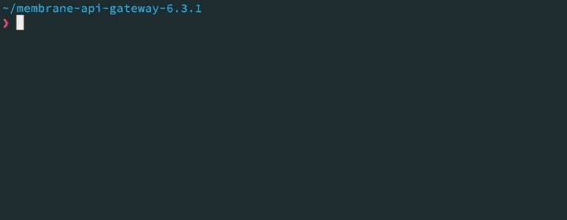

# API Gateway

[](https://github.com/membrane/service-proxy/releases/latest)
[](https://raw.githubusercontent.com/membrane/api-gateway/master/distribution/router/LICENSE.txt)



Lightweight **API Gateway** for **REST**, **GraphQL** and **legacy Web Services**, easily extended with powerful plugins.

Based on the Java platform, Membrane integrates smoothly with major enterprise technologies. Load tests show that Java provides an excellent foundation for high performance and scalability. On a 2021 MacBook Pro, Membrane handles more than 20,000 requests per second, supports up to 10,000 concurrent clients, and can host over 100,000 APIs on a single instance.

The examples below demonstrate how to address a wide range of API Gateway requirements using simple configurations. Version **7.0.0 or newer** is required.

**Forwarding Requests from Port 2000 to a Backend:** 

```yaml
api:
  port: 2000
  target:
    url: https://api.predic8.de
```

**Path Rewriting with an URI Template:**
```yaml
api:
  port: 2000
  path:
    uri: /fruit/{id}
  target:
    url: https://api.predic8.de/shop/v2/products/${pathParam.id}
```

**Deploy OpenAPI and enable Request Validation:** 
```yaml
api:
  port: 2000
  specs:
    - openapi:
        location: "fruitshop-api.yml"
        validateRequests: yes
```

**Issue JSON Web Tokens:**

To issue a JWT for a user, create an API that acts as a simple token endpoint:

```yaml
api:
  port: 2000
  path:
    uri: /token
  flow:
    - basicAuthentication:
        fileUserDataProvider:
          htpasswdPath: .htpasswd
    - request:
        - template:
            src: |
              {
                "sub": "${fn.user()}"
              }
        - jwtSign:
            jwk:
              location: jwk.json
    - return:
        status: 200
```

Authenticated requests to '/token' return a signed JWT in which the username from Basic Authentication is used as the sub claim.

```text
{
  "typ": "JWT",
  "alg": "RS256"
}
.
{
  "sub": "alice",
  "iat": 1765222877,
  "exp": 1765223177
}
.hTL_0-AS8IZgiDUJ6Kg...
```

This example is intentionally minimal, but it highlights the basic building blocks: authenticate the caller, shape the token payload, and sign the result. From there, you can extend it with additional claims, custom logic, or stricter policies to implement tailored API security flows.

## API Gateway eBook

Learn how API Gateways work with real-world examples and insights into Membrane.


[Download instantly](https://www.membrane-api.io/ebook/API-Gateway-Handbook-Pre-Release-2025-07-02.pdf) — **no registration** required.

## Features

### **OpenAPI**

- Deploy APIs from [OpenAPI specifications](https://www.membrane-api.io/openapi/configuration-and-validation).
- Validate requests and responses against [OpenAPI](distribution/examples/openapi/validation-simple) and **JSON Schema**.

### **API Security**
- [JSON Web Tokens](#json-web-tokens), [OAuth2](https://www.membrane-soa.org/service-proxy/oauth2-provider-client.html), [API Keys](#api-keys), [NTLM](distribution/examples/security/ntlm), and [Basic Authentication](https://www.membrane-api.io/docs/current/basicAuthentication.html).
- Built-in [OAuth2 Authorization Server](https://www.membrane-soa.org/service-proxy-doc/4.8/security/oauth2/flows/code/index.html).
- [Rate limiting](#rate-limiting) and traffic control
- Protection for **GraphQL**, **JSON**, and **XML** APIs against malicious inputs.

### **Legacy Web Services**
- Seamless support for [SOAP message routing](#soap-web-services).
- Configure, validate, and rewrite WSDL-based services, including [message validation](#message-validation-against-wsdl-and-xsd).

### **Additional Features**
- **Admin Web Console** for monitoring and management.
- Advanced [load balancing](#load-balancing) to ensure high availability.
- Flexible [message transformation](#message-transformation) for seamless data processing.
- Embeddable reverse proxy HTTP framework to build custom API gateways.
- Traffic shadowing

### **Speed & Size**

- Streams HTTP traffic for low-latency, non-blocking processing.
- Reuses TCP connections via HTTP Keep-Alive to reduce request overhead.
- Lightweight distribution (~55MB) compared to other Java-based gateways.
- Low memory footprint, ideal for containers and cloud-native environments.
- Java-based, yet competitive with C/C++ gateways in performance.

# Content

1. [Getting Started](#getting-started)
    - [Java](#java)
    - [Docker](#docker)
2. [Basics](#basics) Routing, rewriting
    - [API Definition and Configuration](#api-definition-and-configuration)
    - [Simple REST and HTTP Forwarding APIs](#simple-rest-and-http-forwarding-apis)
3. [OpenAPI Support](#openapi-support)
    - [Deploy APIs with OpenAPI](#deploy-apis-with-openapi)
4. [Routing](#routing)
    - [Short Circuit](#short-circuit)
    - [URL Rewriting](#url-rewriting)
5. [Scripting](#scripting)
    - With [Groovy](#groovy-scripts) and [Javascript](#javascript-scripts)
    - [Creating Responses with Groovy](#creating-responses-with-groovy)
6. [Message Transformation](#message-transformation)
    - [Manipulating](#manipulating-http-headers) and [removing](#removing-http-headers) HTTP Headers
    - [Create JSON from Query Parameters](#create-json-from-query-parameters)
    - [Transform JSON into TEXT, JSON or XML with Templates](#transform-json-into-text-json-or-xml-with-templates)
    - [Transform XML into Text or JSON](#transform-xml-into-text-or-json)
    - [Complex Transformations using Javascript or Groovy](#complex-transformations-using-javascript-or-groovy)
    - [Transformation with Computations](#transformation-with-computations)
    - [JSON and XML Beautifier](#json-and-xml-beautifier)
7. [Conditionals with if](#conditionals-with-if)
8. [Security](#security)
    - [API Keys](#api-keys) and [Basic Authentication](#basic-authentication)
    - [SSL/TLS](#ssltls)
    - [JSON Web Tokens](#json-web-tokens) JWT
    - [OAuth2](#oauth2)
    - [Secure APIs with OAuth2](#secure-apis-with-oauth2)
        - [Membrane as Authorization Server](#membrane-as-authorization-server)
        - [XML and JSON Protection](#xml-and-json-protection)
9. [Traffic Control](#traffic-control) Rate limiting, Load balancing
    - [Rate Limiting](#rate-limiting)
    - [Load Balancing](#load-balancing)
10. [Legacy Web Services](#soap-web-services) SOAP and WSDL
    - [API configuration from WSDL](#api-configuration-from-wsdl)
    - [Message Validation against WSDL and XSD](#message-validation-against-wsdl-and-xsd)
11. [Operation](#operation)
    - [Logging](#log-http)
    - [Monitoring with Prometheus and Grafana](#monitoring-with-prometheus-and-grafana)
    - [OpenTelemetry](#opentelemetry-integration)
12. [Community and professional Support](#support)

# Installation

You can run Membrane as Docker container, standalone Java application or install it on Linux as RPM.

## Java

1. **Download and extract**
    - [Download a release](https://github.com/membrane/api-gateway/releases) and unzip it.
2. **Start the Gateway**
    - Open a terminal in the extracted folder.
    - Make sure Java 21 or newer is installed:
    ```bash
    java -version
    ```
    - Start:
        - **Linux/Mac:** `./membrane.sh`
        - **Windows:** `membrane.cmd`
3. **Access the Gateway**
    - Open [http://localhost:2000](http://localhost:2000)
4. **Change the Configuration**

   Modify the preconfigured APIs or add APIs by editing the `proxies.xml` file in the `conf` folder.

## Docker

1. **Start a Membrane container**
   ```bash
   docker run -p 2000:2000 predic8/membrane
   ```
2. **Access the Gateway**

   Test an API by opening [http://localhost:2000](http://localhost:2000).

3. **Change the Configuration**
   - Download [proxies.xml](https://raw.githubusercontent.com/membrane/api-gateway/master/distribution/router/conf/proxies.xml) or:

     ```bash
     wget https://raw.githubusercontent.com/membrane/api-gateway/master/distribution/router/conf/proxies.xml
     ```
   
   - Bind the configuration file to the container.

     **Mac/Linux:**
     ```bash
     docker run -v "$(pwd)/proxies.xml:/opt/membrane/conf/proxies.xml" -p 2000:2000 predic8/membrane
     ```  

     **Windows:**
     ```bash
     docker run -v %cd%\proxies.xml:/opt/membrane/conf/proxies.xml -p 2000:2000 predic8/membrane
     ```

     You can now edit `proxies.xml` and restart the container to apply the changes.


For detailed Docker setup instructions, see the [Membrane Deployment Guide](https://membrane-api.io/deployment/#docker).

## Getting Started

### Explore and Experiment
- Try the code snippets on this page.
- Run the samples in the [examples](distribution/examples#working-api-gateway-examples) folder of the distribution.

### Dive into Tutorials
- Follow the [REST API Tutorial](https://membrane-api.io/tutorials/rest/) to learn about deploying and securing APIs.
- Check out the [SOAP API Tutorial](https://membrane-api.io/tutorials/soap/) for legacy web service integration.

### Documentation

- Read the [API Gateway eBook](https://www.membrane-api.io/api-gateway-ebook.html)
- Look at the [documentation](https://www.membrane-api.io).
- Browse the [reference](https://www.membrane-api.io/docs/)
- Try the recipes from the [cookbook](https://www.membrane-api.io/api-gateway-cookbook.html)

# Basics

### API Definition and Configuration

To define new APIs or modify the existing configuration, edit the `proxies.xml` file located in the `conf` folder. This file serves as the central configuration point for managing API behavior and routing rules.

### Using Samples
Explore and copy the sample snippets below into the `proxies.xml` file and modify them to suit your needs. Then save or restart the gateway to apply the changes. Usually a save will trigger a reload automatically.

For even more samples have a look at the `examples` folder. 


## Simple REST and HTTP Forwarding APIs

### Define an API Route
To forward requests from the API Gateway to a backend, use a simple `api` configuration. The example below routes requests received on port `2000` with a path starting with `/shop` to the backend at `https://api.predic8.de`:

```yaml
api:
  port: 2000
  path:
    uri: /shop
  target:
    url: https://api.predic8.de
```

### Testing the Configuration
After modifying and saving the `proxies.xml` file, open [http://localhost:2000/shop/v2/](http://localhost:2000/shop/v2/)


## OpenAPI Support

Membrane natively supports OpenAPI, allowing you to easily configure the gateway with OpenAPI documents and automatically validate both requests and responses.

### Deploy APIs with OpenAPI
Membrane allows you to configure APIs directly from OpenAPI documents in the `proxies.xml` file. Backend addresses and other details are automatically derived from the OpenAPI description.

#### Example Configuration
The snippet below shows how to deploy an API using an OpenAPI (`openapi/fruitshop-v2-2-0.oas.yml`) with request validation enabled:

```yaml
api:
  port: 2000
  specs:
    - openapi:
        location: openapi/fruitshop-v2-2-0.oas.yml
        validateRequests: true
```  

#### Viewing Deployed APIs
Once configured, a list of deployed APIs is available at: [http://localhost:2000/api-docs](http://localhost:2000/api-docs)


Click on an API title in the list to open the Swagger UI for interactive exploration and testing:


### Learn More
For additional details and a working example, check out the [OpenAPI Example](distribution/examples/openapi).

## Routing
Membrane provides versatile routing with a fallthrough mechanism that applies only the first matching API rule, ensuring precise and efficient routing based on path, HTTP method, or hostname or many other criterias.

### Example: Advanced Routing

The configuration below demonstrates several routing rules:

```yaml
# POST requests
api:
  port: 2000
  method: POST 
  flow:
    - response:
        - static:
            src: POST is blocked!
    - return:
        statusCode: 405
---
# Regex path matching
api:
  port: 2000
  path:
    uri: /shop/v2/products/.*
    isRegExp: true
  target:
    url: https://api.predic8.de
---
# Requests whose HOST header is "www.predic8.de"
api:
  port: 2000
  host: www.predic8.de
  flow:
    - response:
        - static:
            src: "<html>Homepage</html>"
    - return:
        statusCode: 200
---
# Requests with a query parameter city and value Paris
api:
  port: 2000
  test: params.city == 'Paris'
  flow:
    - response:
        - static:
            src: Oui!
    - return:
        statusCode: 200
```

### Configuration Options

| Option   | Description                                                                  |
|----------|------------------------------------------------------------------------------|
| `port`   | port Membrane listens for incoming connections.                              |
| `method` | - HTTP method (e.g., `GET`, `POST`, `DELETE`).<br>- `*` matches any method.  |
| `host`   | - Hostname e.g. `api.predic8.de`<br> - Supports basic globbing with `*`      |
| `test` | - Custom script e.g. `$pathParam.id == '42'`, `$header.contentType == '...'` |
| `path`   | - Request path<br>- Regular expressions can be used with `isRegExp="true"`   |

For more routing options, see the [Membrane API documentation](https://www.membrane-api.io/docs/current/api.html).

### Short Circuit

Membrane lets you create endpoints that return immediately without forwarding requests to a backend.

#### Example: Health Check
The following configuration creates a health check endpoint that responds to requests at [http://localhost:2000/health](http://localhost:2000/health):

```yaml
api:
  port: 2000
  path:
    uri: /health
  flow:
    - response:
      - static:
          src: I'm good.
    - return:
        statusCode: 200
```

#### Example: Blocking Specific Paths
Block paths (e.g., `/nothing`) while allowing other calls to pass through.

**Routing Note:** APIs are matched from top to bottom. When multiple APIs share the same port, place the APIs with stricter routing conditions higher in the configuration.

```yaml
api:
  port: 2000
  path:
    uri: /nothing
  flow:
    - response:
        - static:
            src: "Nothing to see here!"
    - return:
        statusCode: 404
---
api:
  port: 2000
  flow:
    - static:
        src: Other calls
    - return:
        statusCode: 200
```

### URL Rewriting

The URLs of request can be rewritten dynamically before forwarding them to the backend. This is useful for restructuring API paths or managing legacy endpoints.

#### Example
The following configuration rewrites requests starting with `/fruitshop` to `/shop/v2`, preserving the remainder of the path:

```yaml
api:
  port: 2000
  flow:
    - rewriter:
       - map:
          from: ^/fruitshop/(.*)
          to: /shop/v2/$1
  target:
    url: https://api.predic8.de
```

#### Testing
A request to:
```
http://localhost:2000/fruitshop/products/4
```  
will be rewritten to and forwarded to the backend at:
```
https://api.predic8.de/shop/v2/products/4
```

# Scripting

Membrane has powerful scripting features that allow to modify the desired of an API using Groovy or Javascript. 

#### Use Cases

- **Custom Responses**: Tailor responses dynamically based on client requests or internal logic.
- **Mocking APIs**: Simulate API behavior during testing or development phases.
- **Dynamic Headers**: Add headers conditionally based on business rules.
- **Debugging**: Inspect incoming requests during development.

### Groovy Scripts

The following API executes a Groovy script during the request and the response. 

```yaml
api:
  port: 2000
  flow:
    - groovy:
        src: |
          println "I'm executed in the ${flow} flow"
          println "HTTP Headers:\n${header}"
  target:
    url: https://api.predic8.de
```

After invoking [http://localhost:2000](http://localhost:2000) you can see the following output in the console where you have started Membrane:

```text
I'm executed in the REQUEST flow
HTTP Headers:
Host: localhost:2000
User-Agent: Mozilla/5.0 (Macintosh; Intel Mac OS X 10.15; rv:133.0) Gecko/20100101 Firefox/133.0
...

I'm executed in the RESPONSE flow
HTTP Headers:
Content-Length: 390
Content-Type: application/json
```

#### Dynamically Route to random Target 

You can realize a load balancer by setting the destination randomly.  

```yaml
api:
  port: 2013
  flow:
    - groovy:
        src: |
          sites = ["https://api.predic8.de","https://membrane-api.io","https://predic8.de"]
          Collections.shuffle sites
          exchange.destinations = sites
  target: {} # No details needed target uses destinations from exchange
```

### Creating Responses with Groovy

The `groovy` plugin in Membrane allows you to dynamically generate custom responses. The result of the last line of the Groovy script is passed to the plugin. If the result is a `Response` object, it will be returned to the caller.

#### Example
The following example creates a custom JSON response with a status code of `200`, a specific content type, and a custom header:

```yaml
api:
  port: 2000
  flow:
    - groovy:
        src: |
          Response.ok()
            .contentType("application/json")
            .header("X-Foo", "bar")
            .body("""
              {
                "success": true
              }""")
            .build()
```  

#### How It Works
- The `Response.ok()` method initializes a new HTTP response with a status of `200 OK`.
- The `contentType()` method sets the `Content-Type` header, ensuring the response is identified as JSON.
- The `header()` method adds custom headers to the response.
- The `body()` method specifies the response payload.
- The `build()` method finalizes the response object, which is then returned by the `groovy` plugin.

#### Resulting Response
When accessing this API, the response will look like this:

```
HTTP/1.1 200 OK  
Content-Type: application/json  
X-Foo: bar  

{
  "success": true
}
```  

#### Learn More about the Groovy Plugin
For more information about using Groovy with Membrane, refer to:

- [Groovy Plugin Reference](https://www.membrane-api.io/docs/current/groovy.html).
- [Sample Project](distribution/examples/scripting/groovy)

### JavaScript Scripts

In addition to Groovy, Membrane supports JavaScript for implementing custom behavior. This allows you to inspect, modify, or log details about requests and responses.

#### Example
The following example logs all HTTP headers from incoming requests and responses to the console:

```yaml
api:
  port: 2000
  flow:
    - javascript:
        src: |
          console.log("------------ Headers: -------------");
          var fields = header.getAllHeaderFields();
          for (var i = 0; i < fields.length; i++) {
            console.log(fields[i]);
          }
  target:
    url: https://api.predic8.de
```  

The `CONTINUE` keyword ensures that the request continues processing and is forwarded to the target URL.

When a JavaScript script returns a `Response` object as the last line of code, the request flow is interrupted, and the response is sent back to the client. This allows for creating custom responses dynamically.

The following example generates a JSON response and sends it directly to the client:

```yaml
api:
  port: 2000
  flow:
    - javascript:
        src: |
          var body = JSON.stringify({
            foo: 7,
            bar: 42
          });
          Response.ok(body).contentType("application/json").build();
```

#### Learn More
For more details about using JavaScript with Membrane, check the [JavaScript Plugin documentation](https://www.membrane-api.io/docs/current/javascript.html).

## Message Transformation

### Manipulating HTTP Headers

You can modify HTTP headers in requests or responses using Membrane's `setHeader` and `headerFilter` feature. This is particularly useful for enabling CORS or adding custom headers.

#### Example: Adding CORS Headers
The following configuration adds `CORS` headers to the responses received from the backend:

```yaml
api:
  port: 2000
  flow:
    - response:
        - setHeader:
            name: Access-Control-Allow-Origin
            value: "*"
        - setHeader:
            name: Access-Control-Allow-Methods
            value: GET
  target:
    url: https://api.predic8.de
```

### Example: Setting Headers from JSON Body Content

Membrane allows dynamic extraction of values from the JSON body of a request or response and uses them to set HTTP headers. 

#### Example Configuration
The following example extracts the `id` and `name` fields from a JSON body and sets them as custom headers in the response:

```yaml
api:
  port: 2000
  flow:
    - response:
      - setHeader:
          name: X-Product-Id
          value: ${jsonPath('$.id')}
          language: spel
      - setHeader:
          name: X-Product-Name
          value: ${$.name}
          language: jsonpath
  target:
    url: https://api.predic8.de
```

### Removing HTTP Headers

You can easily remove specific HTTP headers from requests or responses (or both) using the `headerFilter` element. This is useful for cleaning up headers or meeting security requirements.

#### Example: Header Filtering
The following configuration demonstrates how to manage headers:

```yaml
api:
  port: 2000
  flow:
    - response:
      - headerFilter:
          rules:
            - include:
                pattern: "X-XSS-Protection"
            - exclude:
                pattern: "X-.*"
  target:
    url: https://www.predic8.de
```  

- **`<include>`:** Specifies headers to retain.
- **`<exclude>`:** Defines headers to remove. Wildcards can be used for patterns.

The first matching rule will be acted upon by the filter.

### Create JSON from Query Parameters

```yaml
api:
  port: 2000
  flow:
    - request:
        - template:
            contentType: application/json
            pretty: true
            src: |
              { "answer": ${params.answer} }
    - return:
        status: 200
```

Call this API with `http://localhost:2000?answer=42`.

## Transform JSON into TEXT, JSON or XML with Templates

Call the following APIs with this request:

```
curl -d '{"city":"Berlin"}' -H "Content-Type: application/json" "http://localhost:2000"
```

This template will transform the JSON input into plain text:

```yaml
api:
  port: 2000
  flow:
    - request:
        - template:
            contentType: text/plain
            src: |
              City: ${json.city}
        - return:
            status: 200
```

...into a different JSON:

```yaml
api:
  port: 2000
  flow:
    - request:
        - template:
            contentType: application/json
            src: |
              {
                "destination": "${json.city}"
              }
    - return:
        status: 200
```

...or into XML:

```yaml
api:
  port: 2000
  flow:
    - request:
        - template:
            contentType: application/xml
            src: |
              <places>
                  <place>${json.city}</place>
              </places>            
    - return:
        status: 200
```

### Transform XML into Text or JSON

You can use XPath to extract values from an XML message and insert them into a `template`.

```yaml
api:
  port: 2000
  flow:
    - request:
        - template:
            src: |
              Buenas noches, ${fn.xpath('/person/@firstname')}
        - return:
            status: 200
```

See: [message-transformation examples](./distribution/examples/message-transformation)

## Complex Transformations using Javascript or Groovy

Use the Javascript or Groovy plugin for more powerful yet simple transformations.

```yaml
api:
  port: 2000
  flow:
    - request:
        - javascript:
            src: |
              ({ id:7, place: json.city })
    - return:
        status: 200
        contentType: application/json
```

Call the API with this curl command:

```
curl -d '{"city":"Berlin"}' -H "Content-Type: application/json" "http://localhost:2000"
```

## Transformation with Computations

This script transforms the input and adds some calculations.

```yaml
api:
  port: 2000
  flow:
    - request:
        - javascript:
            src: |
              function convertDate(d) {
                return d.getFullYear() + "-" + ("0"+(d.getMonth()+1)).slice(-2) + "-" + ("0"+d.getDate()).slice(-2);
              }

              ({
                id: json.id,
                date: convertDate(new Date(json.date)),
                client: json.customer,
                total: json.items.map(i => i.quantity * i.price).reduce((a,b) => a+b),
                positions: json.items.map(i => ({
                pieces: i.quantity,
                price: i.price,
                article: i.description
              }))
              })
    - return:
        status: 200
```

See [examples/javascript](distribution/examples/scripting/javascript) for a detailed explanation. The same transformation can also be realized with [Groovy](distribution/examples/scripting/groovy)

## JSON and XML Beautifier

Use the `beautifier` to pretty print JSON or XML.

```yaml
api:
  port: 2000
  flow:
    - response:
        - beautifier: {}
        - template:
            contentType: application/json
            src: |
              { "foo": { "bar": { "baz": 99 }}}
    - return:
        status: 200
```

Result:

```json
{
  "foo" : {
    "bar" : {
      "baz" : 99
    }
  }
}
```

# Conditionals with if

This example shows how to intercept error responses from a backend and replace them with a custom response.

```yaml
api:
  port: 2000
  flow:
    - response:
        - if:
            test: statusCode >= 500
            language: spel
            flow:
              - static:
                  src: Failure!
    - target:
        url: https://httpbin.org/status/500
```

# Security

Membrane offers all kinds of security features to protect APIs and backend servers.

## API Keys

API keys can be defined in the configuration, loaded from a file, or stored in a database. Requests are authenticated by validating the provided API key against these sources.

You can also define permissions using scopes in OpenAPI and enforce them with API keys, OAuth 2.0, or JWT-based authentication.

This configuration secures all APIs globally. Alternatively, API keys can be defined for individual APIs only.

```yaml
global:
  - apiKey:
      stores:
        - simple:
            - secret:
                value: aed8bcc4-7c83-44d5-8789-21e4024ac873
            - secret:
                value: 08f121fa-3cda-49c6-90db-1f189ff80756
      extractors:
        - headerExtractor:
            headerName: X-Api-Key
```

### Advanced Use Cases

More advanced scenarios are supported, including:

- API keys in headers, query parameters or at any other location using expressions.
- Role-based access control (RBAC) with fine-grained permissions.
- OpenAPI defined permissions.

See the [API Key Plugin Examples](./distribution/examples/security/api-key/rbac/README.md) for detailed configurations.

## JSON Web Tokens

The API below only allows requests that present a valid JSON Web Token issued by Microsoft Azure Entra ID. The JWT validator can also be used with other identity providers.

```yaml
api:
  port: 2000
  flow:
    - jwtAuth:
        expectedAud: api://2axxxx16-xxxx-xxxx-xxxx-faxxxxxxxxf0
        jwks:
          jwksUris: https://login.microsoftonline.com/common/discovery/keys
  target:
    url: https://your-backend
```

## OAuth2

### Secure APIs with OAuth2

Use OAuth2/OpenID to secure endpoints against Google, Azure Entra ID, GitHub, Keycloak or Membrane Authentication Servers.

```yaml
api:
  port: 2000
  flow:
    - oauth2Resource2:
        membrane:
          src: http://localhost:8000
          clientId: abc
          clientSecret: def
          scope: openid profile
          claims: username
          claimsIdt: sub
    - request:
        # Forward the authenticated user’s email to the backend in an HTTP header.
        - setHeader:
            name: X-EMAIL
            value: ${property['membrane.oauth2'].userinfo['email']}
  target:
    url: http://backend
```

Try the tutorial [OAuth2 with external OpenID Providers](https://membrane-soa.org/api-gateway-doc/current/oauth2-openid.html)

### Membrane as Authorization Server

Operate your own identity provider:

```xml

<api port="2000">
  <oauth2authserver location="logindialog" issuer="http://localhost:2000" consentFile="consentFile.json">
    <staticUserDataProvider>
        <user username="john" password="password" email="john@predic8.de"/>
    </staticUserDataProvider>
    <staticClientList>
        <client clientId="abc" clientSecret="def" callbackUrl="http://localhost:2001/oauth2callback"/>
    </staticClientList>
    <bearerToken/>
    <claims value="aud email iss sub username">
        <scope id="username" claims="username"/>
        <scope id="profile" claims="username email password"/>
    </claims>
  </oauth2authserver>
</api>
```

See the [OAuth2 Authorization Server](https://www.membrane-soa.org/service-proxy-doc/4.8/oauth2-code-flow-example.html) example.

## Basic Authentication

```xml
<api port="2000">
  <basicAuthentication>
    <user name="bob" password="secret"/>
    <user name="alice" password="secret"/>
  </basicAuthentication>
  <target host="localhost" port="8080"/>
</api>
```

## SSL/TLS

Route to SSL/TLS secured endpoints:

```xml
<api port="8080">
  <target url="https://api.predic8.de"/> <!-- Note the s in https! -->
</api>
```

Secure endpoints with SSL/TLS:

```xml

<api port="8443">
  <ssl>
    <keystore location="membrane.p12" password="secret" keyPassword="secret" />
    <truststore location="membrane.p12" password="secret" />
  </ssl>
  <target host="localhost" port="8080"  />
</api>
```

### XML and JSON Protection

Membrane offers protection mechanisms to secure your APIs from common risks associated with XML and JSON payloads.

#### XML Protection

The `xmlProtection` plugin inspects incoming XML requests and mitigates risks such as:

- External entity references (XXE attacks).
- Excessively large element names.
- High numbers of attributes or deeply nested structures.

**Example:**
```xml
<api port="2000">
   <xmlProtection />
   <target url="https://api.predic8.de"/>
</api>
```  

See [XML Protection Reference](https://www.membrane-api.io/docs/current/xmlProtection.html).

#### JSON Protection

The `jsonProtection` plugin safeguards APIs from JSON-based vulnerabilities by setting limits on:

- **Depth**: Prevents overly nested JSON structures.
- **Key Length**: Restricts excessively long keys.
- **Object Size**: Maximum number of fields in a JSON object.
- **String Length**: Controls maximum length of string values.
- **...**

**Example:**

```xml
<api port="2000">
   <jsonProtection maxDepth="5" maxKeyLength="100" maxStringLength="100000"/>
   <target url="https://api.predic8.de"/>
</api>
```  

See [JSON Protection](https://www.membrane-api.io/docs/current/jsonProtection.html).

# Traffic Control

## Rate Limiting

Limit the number of incoming requests:

```xml

<api port="2000">
    <rateLimiter requestLimit="3" requestLimitDuration="PT30S"/>
    <target host="localhost" port="8080"/>
</api>
```

## Load balancing

Distribute workload to multiple backend nodes. [See the example](distribution/examples/loadbalancing)

```xml

<api port="8080">
    <balancer name="balancer">
        <clusters>
            <cluster name="Default">
                <node host="my.backend-1" port="4000"/>
                <node host="my.backend-2" port="4000"/>
                <node host="my.backend-3" port="4000"/>
            </cluster>
        </clusters>
    </balancer>
</api>
```

# Websockets

Route and intercept WebSocket traffic:

```xml

<api port="2000">
    <webSocket url="http://my.websocket.server:1234">
        <wsLog/>
    </webSocket>
    <target port="8080" host="localhost"/>
</api>
```

See [documentation](https://www.membrane-soa.org/service-proxy-doc/4.8/websocket-routing-intercepting.html)

# SOAP Web Services

Integrate legacy services.

## API configuration from WSDL

SOAP proxies configure themselves by analysing WSDL:

```xml

<soapProxy wsdl="http://thomas-bayer.com/axis2/services/BLZService?wsdl"/>
```

## Message Validation against WSDL and XSD

The _validator_ checks SOAP messages against a WSDL document including referenced XSD schemas.

```xml

<soapProxy wsdl="http://thomas-bayer.com/axis2/services/BLZService?wsdl">
    <validator/>
</soapProxy>
```


# Operation

## Log HTTP

Log data about requests and responses to a file or [database](distribution/examples/logging/jdbc-database) as [CSV](distribution/examples/logging/csv)
or [JSON](distribution/examples/logging/json) file.

```xml

<api port="2000">
    <log/> <!-- Logs to the console -->
    <statisticsCSV file="./log.csv"/> <!-- Logs fine-grained CSV -->
    <target url="https://api.predic8.de"/>
</api>
```

## Instrumentation

### Monitoring with Prometheus and Grafana

This API will expose metrics for Prometheus at [http://localhost:2000/metrics](http://localhost:2000/metrics):

```xml
<api port="2000">
  <path>/metrics</path>
  <prometheus />
</api>
```


Grafana dashboard from Membrane metrics.
 
See [Prometheus and Grafana example](distribution/examples/monitoring-tracing/prometheus-grafana).

### OpenTelemetry Integration
Membrane supports integration with **OpenTelemetry** traces using the `openTelemetry` plugin and the `W3C` propagation standard. This enables detailed tracing of requests across Membrane and backend services.

  
This diagram illustrates Membrane in a tracing setup with a backend service and a database connection.

#### Example Setup
The configuration below shows Membrane forwarding requests to a backend, while exporting OpenTelemetry data to a collector:

```xml
<api port="2000">
    <openTelemetry sampleRate="1.0">
        <otlpExporter host="localhost" port="4317"/>
    </openTelemetry>
    <target host="localhost" port="3000"/>
</api>
```  

For a working example and detailed setup, see the [OpenTelemetry Example](./distribution/examples/monitoring-tracing/opentelemetry).

# Support

## Community Support

To get support from our community, please post your questions to our [Discussions](https://github.com/membrane/api-gateway/discussions) page @GitHub.

If you find a bug, please report it using [GitHub Issues](https://github.com/membrane/api-gateway/issues). Please provide a minimal example that reproduces the issue and the version of Membrane you are using.

## Enterprise-grade Support

See [commercial support options and pricing](https://www.membrane-api.io/api-gateway-pricing.html).
