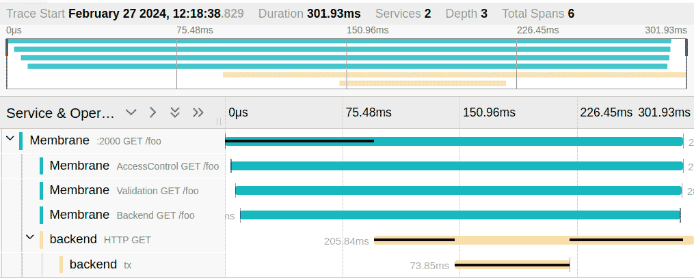

# Tracing with OpenTelemetry

Membrane supports distributed tracing based on the [OpenTelemetry](https://opentelemetry.io/) specification.

With the OpenTelemetry plugin, API traffic can be observed end to end. Membrane collects tracing data for requests flowing through the gateway and exports it to an OTLP endpoint. In this example, Jaeger is used as the backend.

To instrument an API, add the `openTelemetry` plugin to the API configuration.

## Run the Example

1. Start Jaeger with:
```dockerfile
docker run -it --name jaeger -e COLLECTOR_OTLP_ENABLED=true -p 16686:16686 -p 4317:4317 -p 4318:4318 jaegertracing/all-in-one:latest
```

2. Start Membrane: `membrane.cmd` or `./membrane.sh`

3. Call the first endpoint in the telemetry chain:

   ```bash
   curl http://localhost:2000
   ```

4. You should see `Greetings from the backend!` in your terminal.
5. Open the Jaeger UI in your browser: `http://localhost:16686`
6. Select Membrane as the service and click on `Find Traces`.
A span created by Membrane should be visible in the [Jaeger UI](http://localhost:16686).

7. Check the headers printed to the console. You will see headers such as `traceparent`, which indicate the trace and span context involved in the request.
8. The trace and span IDs are also written into the MDC log context and appear in every log line produced during that request:

   ```
   10:23:24,309  INFO 71 router /127.0.0.1:51225 LogInterceptor:161 {api=Backend, spanId=c3842209e491c98d, traceId=037203a62701acf8d0da0080dae55aef} 
   ```

   The `[traceId/spanId]` segment is printed by the included `log4j2.xml`. When no span is active the brackets are empty (`[/]`).

**How it is done**

Take a look at the `apis.yaml`.

The openTelemetry plugin can be used in several ways:

a.) Globally, in a shared interceptor chain that applies to all APIs (as shown in apis.yaml)
b.) Per API, by defining it directly inside the API flow
c.) With reusable interceptor chains. See: [Reusable Plugin Chains](../../extending-membrane/reusable-plugin-chains)

Example configuration for a single API:

```yaml
api:
  port: 2000
  flow:
    - openTelemetry:
        sampleRate: 1.0
        otlpExporter:
          host: localhost
          port: 4317
          transport: grpc
  target:
    url: http://localhost:2001
```

**Note on Transport:**

The OTLP exporter is configured by default to use gRPC. To use HTTP, set the `transport` field to `http` and set the `port` to `4318`.

**MDC Log Context:**

The `openTelemetry` plugin writes the current `traceId` and `spanId` into the SLF4J MDC for the duration of each request. This lets any log line emitted by Membrane — or your own interceptors — be correlated directly with a trace in Jaeger without any extra instrumentation. The included `log4j2.xml` exposes them via the `[%X{traceId}/%X{spanId}]` pattern. To add them to your own Log4j2 layout use the same `%X{traceId}` and `%X{spanId}` conversion specifiers.

> **Note:** Place `openTelemetry` either globally in the transport (as shown in `apis.yaml`) or as the **first plugin** in an API flow. Only log lines produced by plugins that run *after* `openTelemetry` will carry the `traceId` and `spanId` in the MDC.
