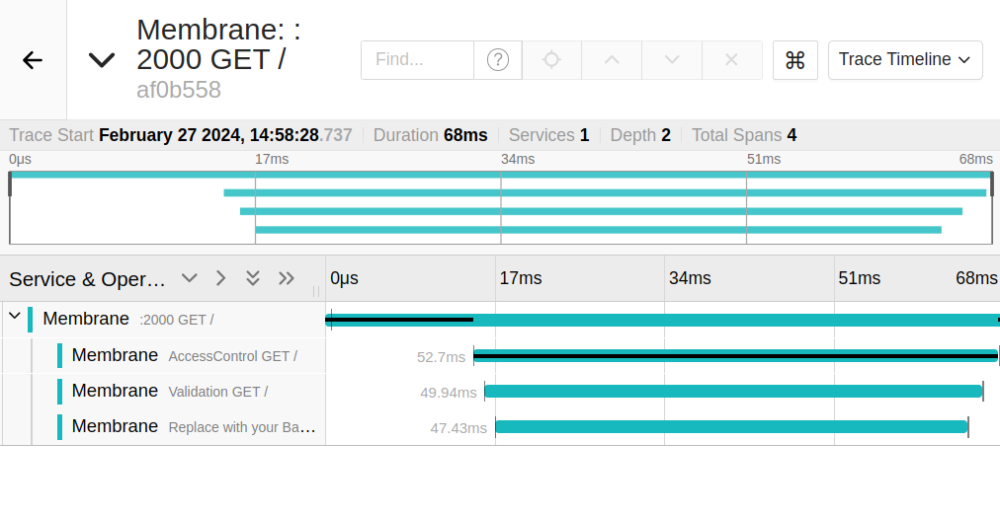

# Tracing with OpenTelemetry

Membrane offers support for tracing according to the [OpenTelemetry](https://opentelemetry.io/) specification.

The usage of APIs can be observed with the OpenTelemetry plugin. Membrane collects data about the processes flowing
through it and sends it to an OTLP endpoint, in this case, a jaeger backend.

To instrument an API add the `opentelemetry` plugin to it.

## Run the Example

1. Start Jaeger with:
```dockerfile
docker run -d --name jaeger -e COLLECTOR_OTLP_ENABLED=true -p 16686:16686 -p 4317:4317 -p 4318:4318 jaegertracing/all-in-one:latest
```

2. Run `membrane.cmd` or `./membrane.sh` to start Membrane.

3. Call the first endpoint in the telemetry chain:

   `curl http://localhost:2000`.

4. You should see `Hello from a faked backend!` in your terminal.
5. Open `localhost:16686` in the browser to access the Jaeger UI.
6. Select Membrane as the service and click on `Find Traces`.
A span created by Membrane should be visible in [Jaeger UI](http://localhost:16686).

7. Examine the printed header fields on the console. You will see headers called `traceparent`, these denote which spans were involved in the request.

**HOW IT IS DONE**

Take a look at the `proxies.xml`.

```xml
<router>

   <transport>
      <ruleMatching />
      <logContext />
      <exchangeStore />
      <dispatching />
      <reverseProxying />
      <openTelemetry sampleRate="1.0"> <!--globally registers OpenTelemetry for every api-->
         <otlpExporter host="localhost" port="4317" transport="grpc"/>
      </openTelemetry>
      <userFeature />
      <internalRouting />
      <httpClient />
   </transport>

   <api port="2000">
      <target url="http://localhost:2001" />
   </api>

   <api port="2001" name="AccessControl">
      <target url="http://localhost:2002" />
   </api>

   <api port="2002" name="Validation">
      <target url="http://localhost:2003" />
   </api>

   <api port="2003" name="Replace with your Backend">
      <request>
         <!-- Print the request headers.
              traceparents will be added to them
              showing which spans were involved
              in the exchange.                   -->
        <log message="Header: ${header}"/>
      </request>
      <response>
         <template>Hello from a faked backend!</template>
      </response>
      <return/>
   </api>
</router>
```
The `openTelemetry` plugin can be utilized in two ways: either in a global context for all APIs using the `<transport>` tag, as demonstrated above, or it can be specifically defined for individual APIs by placing it within the `<api>` tag.
```xml
<api port="2000">
   <openTelemetry sampleRate="1.0">
      <otlpExporter host="localhost" port="4317" transport="grpc"/>
   </openTelemetry>
   <target host="localhost" port="3000"/>
</api>
```

**Note:**

The OTLP Exporter is configured by default to use gRPC. You can omit the `transport` field in the configuration when using gRPC.

To use HTTP, set the `transport` field to `http` and set the `port` to `4318`.
