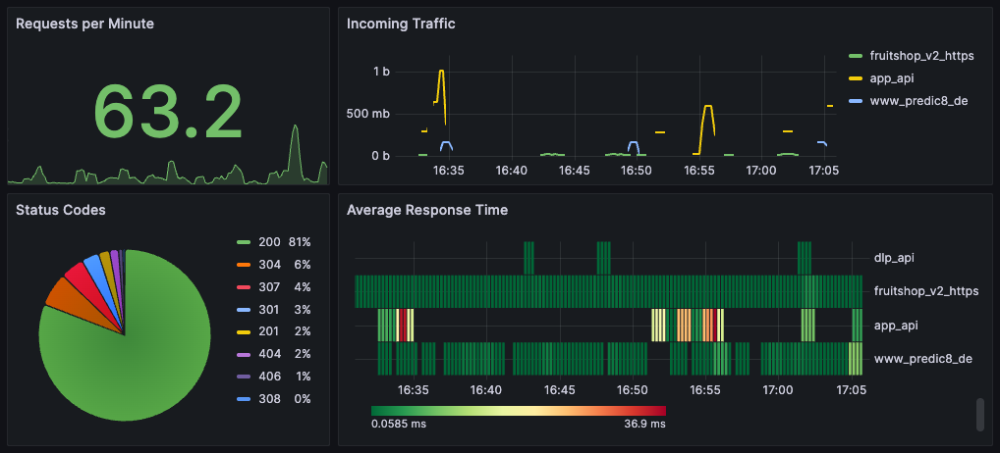

# Monitoring with Prometheus and Grafana

Membrane allows the observation of APIs traffic and other key metrics via Prometheus and Grafana.

The Prometheus plugin provides an HTTP endpoint that exposes the metrics.

Membrane supports monitoring through the integration with Prometheus.


## Run the Example

To monitor APIs using Prometheus and Grafana, follow the steps below:

### Providing a Metrics Endpoint for Prometheus

1. Start a setup of Membrane, Prometheus and Grafana with Docker Compose:

   ```bash
   docker compose up
   ```

2. Access the following endpoints to generate traffic:

   - [localhost:2001](http://localhost:2001) - Returns a status code of 200.
   - [localhost:2002](http://localhost:2002) - Returns a status code of 404.
   - [localhost:2003](http://localhost:2003) - Returns a status code of 500.

    You can use cURL commands to access these endpoints, e.g.:

   ```bash
   curl -v http://localhost:2001
   curl -v http://localhost:2002
   curl -v http://localhost:2003
   ```

3. Then, query the metrics endpoint of Membrane

   - Open [http://localhost:2000/metrics](http://localhost:2000/metrics)

### Quering Prometheus

1. Open Prometheus at [http://localhost:9090](http://localhost:9090)
2. Search for `membrane_count`.


### Grafana

1. Access [localhost:3000](http://localhost:3000) in your browser.
2. Log in with the default credentials: username `admin` and password `admin`. (When prompted to change the password, press `skip`.)
3. Click on `Dashboards` from the left-hand menu.
4. Click on `New` and select `Import`.
5. Navigate to the `dashboards` directory in this folder and pick a dashboard JSON file.
  - `full.json` displays nearly all available metrics.
  - `openapi.json` displays OpenAPI validation metrics. This requires the OpenAPI plugin to be active in an API.
  - `minimal.json` is pictured below:



**HOW IT IS DONE**

Take a look at the `proxies.xml`.

```xml
<router>
    <api port="2000">
        <path>/metrics</path>
        <prometheus />
    </api>
    <api port="2001">
        <return statusCode="200"/>
    </api>
    <api port="2002">
        <return statusCode="404"/>
    </api>
    <api port="2003">
        <return statusCode="500"/>
    </api>
</router>
```

The `<prometheus />` tag configures the specified API endpoint for data collection by Prometheus.