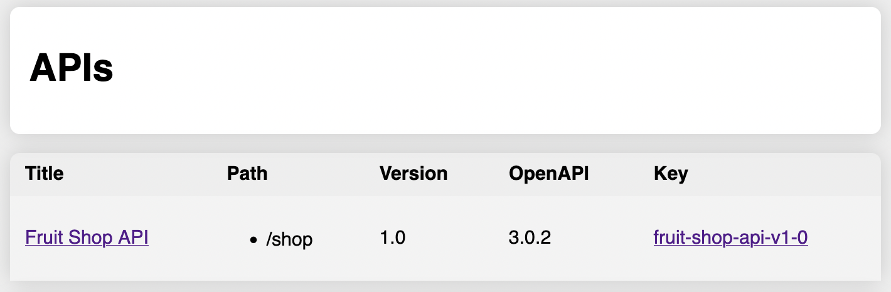

# openAPIProxy - OpenAPI Configuration and Validation

Membrane's **openAPIProxy** offers support for [OpenAPI](https://github.com/OAI/OpenAPI-Specification) and provides the following features:

- Configuration from OpenAPI
- Request and response validation against OpenAPI, including paths, parameters and JSON bodies.
- Rewriting of addresses
- Swagger UI integration 

This page serves as a reference for the functions and configuration. See also the examples:

- [openAPIProxy, UI and Swagger UI](openapi-proxy)
- [OpenAPI validation](openapi-validation-simple)
- [OpenAPI validation extended sample](openapi-validation)

The **openAPIProxy** is featured in Membrane version 5 and newer and supports OpenAPI from version 3.0.0. Version 2 is not supported.


# Configuration

An _openAPIProxy_ can be added to the _proxies.xml_ configuration file. See the example in the [openapi-proxy/](openapi-proxy/) folder.

```xml
<router>
    <openAPIProxy port="2000">
        <openapi location="fruitshop-api.yml"/>
        <openapi dir="openapi"/>
        <openapi location="https://developer.lufthansa.com/swagger/export/21516"/>
        <openapi location="https://api.apis.guru/v2/specs/nowpayments.io/1.0.0/openapi.json"/>
        <openapi location="https://raw.githubusercontent.com/openai/openai-openapi/master/openapi.yaml"/>
    </openAPIProxy>
</router>
```

The _spec_ element adds OpenAPI documents to the configuration. You can add _*.json_, _*.yml_ and _*.yaml_ files in a folder using the _dir_ attribute or single local or remote files using the _location_ attribute. 

The addresses of the backend servers and the basepaths are taken from the OpenAPI specification. Suppose an OpenAPI document contains the _servers_ field below. The proxy will match requests against the basepath ```/shop``` and in case of a match it will forward the request to the backend server ```api.predic8.de``` using TLS.

```yaml
servers:
  - url: https://api.predic8.de/shop
```

If the basepath does not match, the next API is checked. 

It is also possilbe to configure the backend address using a [target](https://www.membrane-soa.org/service-proxy-doc/4.8/configuration/reference/target.htm) in the configuration. Then the addresses in the ```server``` field of the OpenAPI are ignored and the request is sent to the address from the _target_ element.

```xml
<serviceProxy>
    <openAPIProxy port="2000">
        <openapi dir="openapi"/>
        <target host="api.predic8.de" port="8080"/>
    </openAPIProxy>
</serviceProxy>
```

# OpenAPI Validation

Membrane can validate requests and responses against OpenAPI definitions and check:

- Methods and paths
- Query and path parameters
- Content types
- Status codes
- Body content according to the JSON Schema component definitions 

Validation can be activated for requests and responses separatly. Set _validationDetails_ to _no_ if you do not want to send validation errors in detail to the client.

```xml
<openapi location="fruitshop-api.yml" 
      validateRequests="yes" 
      validateResponses="yes" 
      validationDetails="yes"/>
```

As an alternative way validation can be turned on in the OpenAPI documents using the _x-membrane-validation_ field. The configuration in the _proxies.xml_ file will overwrite the _x-membrane-validation_ field.

```yaml
x-membrane-validation:
  requests: true
  responses: true
  details: false
```

# Overview and Swagger UI

The __openAPIProxy__ has an UI that can be reached on its port e.g. [http://localhost:2000/api-doc](http://localhost:2000/api-doc). Follow the links on the left to access the Swagger UI or the link on the right to download the OpenAPI document.



To get a JSON description of the deployed OpenAPI documents call the same <a href="curl http://localhost:2000/api-doc">URL</a> outside of the browser e.g. in curl or Postman:

```
curl http://localhost:2000/api-doc
```


# Rewirting of Server Addresses

When an API is published on a gateway the OpenAPI must point to the gateway instead of pointing to the backend server. Rewriting changes the backend addresses of an OpenAPI document to the adress of the gateway.

The _openAPIProxy_ exposes the OpenAPI specifications in the UI and over an endpoint:

```
/api_docs/<<id of the api>>
```

The addresses in the OpenAPI's _/servers_ field are rewritten to the address the endpoint is called on the gateway. Suppose the OpenAPI has the following servers field:

```yaml
servers:
- url: "http://fruit-shop.api-demos.svc.ack.predic8.de:8080/shop"
```

And you send a request to Membrane like this:

```http request
GET /api-doc/fruit-shop-api-v1-0
Host: api.predic8.de:443
```

Then the rewritter of the _openAPIProxy_ will turn the _servers_ field into:

```yaml
servers:
- url: "https://api.predic8.de:443/shop"
```

If you use the rewritten OpenAPI document for your client, than requests will be sent to Membrane at _https://api.predic8.de:443/shop_ and then forwared to the destination _http://fruit-shop.api-demos.svc.ack.predic8.de:8080/shop_.


# SSL/TLS

TLS for incoming and outgoing connections can be configured in the same way as for the _serviceProxy_. See the documentation for the [ssl](https://www.membrane-soa.org/service-proxy-doc/4.8/configuration/reference/ssl.htm) element.

```xml
<openAPIProxy port="2000">
    <openapi dir="openapi"/>
    <ssl>
        <keystore location="..."/>
        <truststore location="..."/>
    </ssl>
    <target host="api.predic8.de" port="443">
        <ssl>
            <keystore location="..."/>
            <truststore location="..."/>
        </ssl>
    </target>
</openAPIProxy>
```


# Plugins / Interceptors

The behaviour of the _openAPIProxy_ can be modified like other proxies with plugins and interceptors. See the [examples](..) and the [configuration reference](http://membrane-soa.org/service-proxy-doc/4.8/configuration/reference/).

```xml
<api port="2000">
    <openapi dir="openapi"/>
    <tokenValidator endpoint="https://login.predic8.de/oauth2/userinfo"/>
    <log/>
</api>
```

## Ids of OpenAPI Documents

Membrane needs unique ids for each OpenAPI document to provide a Swagger UI and the _/api-docs/{id}_ endpoint. The id is generated from the title and version of the API. For the following document Membrane will generate the id _fruit-shop-api-v1-0_.

```yaml
info:
  title: "Fruit Shop API"
  version: "1.0"
```

To give an API a custom id the _x-membrane-id_ field can be used.

```yaml
info:
  title: Fruit Shop API
  version: '1.0'
  x-membrane-id: fruitshop
```

To the id the version will be appended so the id will be _fruitshop-v-1-0_.
