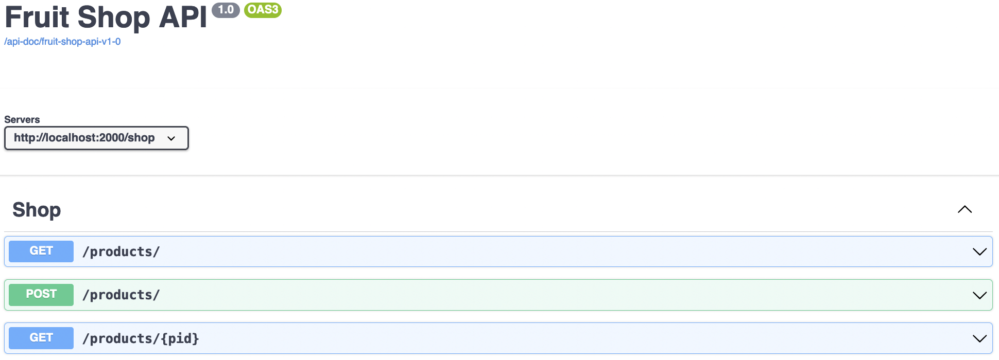
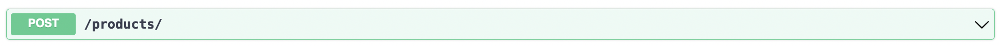

# OpenAPI Configuration Example

This sample demonstrates:

* How to use OpenAPI as a source of API Gateway configuration
* How to validate requests and responses against OpenAPI definitions
* How to publish a Swagger UI for depolyed APIs

## Running the Example

Make sure to use Membrane version 5 or newer.

1. Go to the _examples/openapi/openapi-proxy_ directory and start Membrane:

```shell
./service-proxy.sh
```

or:

```
service.proxy.bat
```


2. You can _curl_ now for a JSON description of deployed APIs from  OpenAPI. 

```JSON
curl localhost:2000/api-docs

{
  "fruit-shop-api-v1-0" : {
    "openapi" : "3.0.2",
    "title" : "Fruit Shop API",
    "version" : "1.0",
    "openapi_link" : "/api-doc/fruit-shop-api-v1-0",
    "ui_link" : "/api-doc/ui/fruit-shop-api-v1-0"
  }
}
```

Open the same URL [http://localhost:2000/api-doc](http://localhost:2000/api-doc) in the browser, and you get a UI.


3. Click on [Fruit Shop API](http://localhost:2000/api-doc/ui/fruit-shop-api-v1-0) on the left to open the Swagger UI of the API.



4. Click on __POST /products__ to expand it.



5. Next click on _Try it out_ and then on _Execute_. The call should succeed and create a new product.

6. Change the _price_ to a negative number like _-2.7_ and _execute_ the call again.

```JSON
{
  "name": "Figs",
  "price": -2.7
}
```

The validator checks the request against the OpenAPI definition. Cause the value for price is invalid a _400 Bad Request_ status code and an error message is returned.
	
```JSON
{
  "method": "POST",
  "uriTemplate": "/products/",
  "path": "/shop/products/",
  "validationErrors": {
    "REQUEST/BODY#/price": [
      {
        "message": "-2.7 is smaller than the minimum of 0",
        "complexType": "Product",
        "schemaType": "number"
      }
    ]
  }
}
```

7. Try also a value for _name_ that is longer than 10 characters.

8. Have a look at the configuration in the `proxies.xml`file:

```xml
<api port="2000">
  <openapi location="fruitshop-api.yml"
           validateRequests="yes"
           validateResponses="yes"
           validationDetails="yes"/>
</api>
```

For more about the OpenAPI Validation features of Membrane have a look at:

- [Simple Validation Example](../validation-simple)
- [Extended Validation Example](git/predic8/service-proxy/distribution/examples/openapi/validation/)


