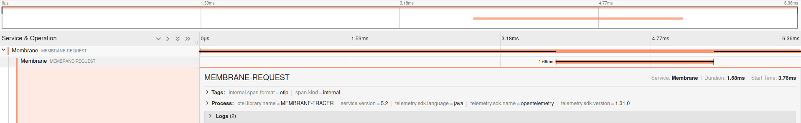

# Tracing with OpenTelemetry

Membrane offers support for tracing according to the [OpenTelemetry](https://opentelemetry.io/) specification.

The usage of APIs can be observed with the OpenTelemetry plugin. Membrane collects data about the processes flowing
through it and sends it to an OTLP endpoint, in this case, a jaeger backend.

To instrument an API add the `opentelemetry` plugin to it.

## Run the Example

1. Start jaeger with:
```dockerfile
docker run -d --name jaeger -e COLLECTOR_OTLP_ENABLED=true -p 16686:16686 -p 4317:4317 -p 4318:4318 jaegertracing/all-in-one:latest
```

2. Run `service-proxy.bat` or `./service-proxy.sh` in this folder.

3. Call an API hosted by Membrane:

   `curl http://localhost:2000`.

4. You should see the headers in your terminal which include `traceparent` and a trace,
   created by Membrane should be visible in the [jaeger frontend](http://localhost:16686). Open `localhost:16686` in the browser.

5. Take a look into the `proxies.xml
```xml

<router>
    <api port="2000">
        <opentelemetry
                jaegerPort="4317"
                jaegerHost="localhost"
                sampleRate="1.0"
        />
        <target host="localhost" port="3000"/>
    </api>

    <api port="3000" method="GET">
        <opentelemetry
                jaegerPort="4317"
                jaegerHost="localhost"
                sampleRate="1.0"
        />
        <request>
           <template contentType="text/plain" pretty="yes"><![CDATA[
                Header:
                <% for(h in header.allHeaderFields) { %>
                   <%= h.headerName %> : <%= h.value %>
                <% } %>
            ]]></template>
        </request>
        <return statusCode="200"/>
    </api>
</router>

```

If you already run an OpenTelemetry Service, you just need the first entry.
The second `<api>` entry is meant to simulate another OpenTelemetry service and serves as an example.



