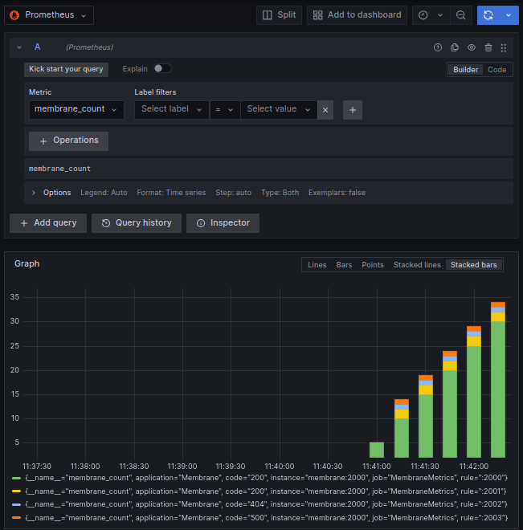

# Monitoring with Prometheus and Grafana

Membrane supports monitoring through the integration with Prometheus.

With the Prometheus plugin, Membrane enables the observation of APIs. It gathers metrics about the processes passing through it and makes them available for scraping by Prometheus. This data can then be used for monitoring and alerting purposes.

To enable monitoring for an API, simply add the Prometheus plugin to it.
## Run the Example

To monitor APIs using Prometheus and Grafana, follow the steps below:

1. Start the example environment with Docker Compose:

   ```bash
   docker-compose up
   ```

2. Access the following endpoints:

  - [localhost:2001](http://localhost:2001) - Returns a status code of 200.
  - [localhost:2002](http://localhost:2002) - Returns a status code of 404.
  - [localhost:2003](http://localhost:2003) - Returns a status code of 500.

   You can use cURL commands to access these endpoints, e.g.:

   ```bash
   curl -v http://localhost:2001
   curl -v http://localhost:2002
   curl -v http://localhost:2003
   ```

3. After accessing the endpoints, proceed to Grafana:

  - Access [localhost:3000](http://localhost:3000) in your browser. 
  - Log in with the default credentials: username `admin` and password `admin`.
  - Click on "Explore" from the left-hand menu.
  - You can now select different queries to display the collected metrics.

   

**HOW IT IS DONE**

Take a look at the `proxies.xml`.

```xml
<router>
    <api port="2000">
        <prometheus />
    </api>
    <api port="2001">
        <return statusCode="200"/>
    </api>
    <api port="2002">
        <return statusCode="404"/>
    </api>
    <api port="2003">
        <return statusCode="500"/>
    </api>
</router>
```

The `<prometheus />` tag configures the specified API endpoint for data collection by Prometheus.